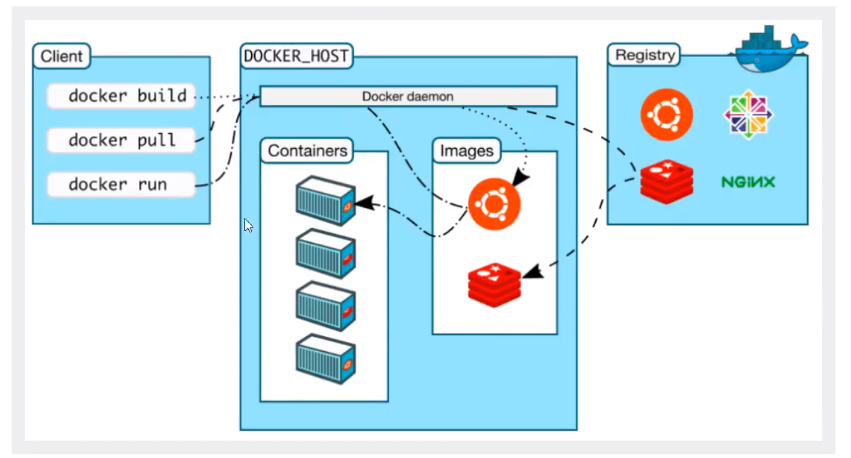
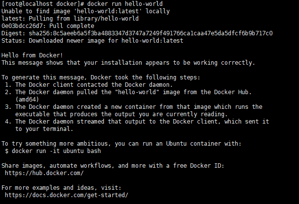
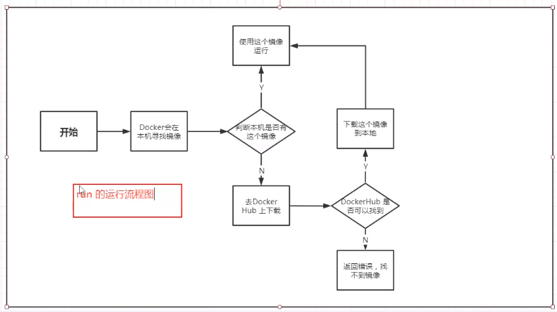
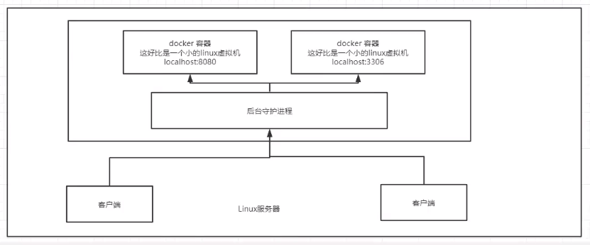
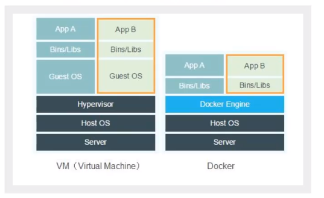

## Docker简介

## Docker 基本组成



## Docker安装

CentOS 需要 version 7以上

首先设置Repository

```shell
$ sudo yum install -y yum-utils

$ sudo yum-config-manager \
    --add-repo \
    https://download.docker.com/linux/centos/docker-ce.repo
$ yum makecache
```

安装Docker引擎

```shell
$ sudo yum install docker-ce docker-ce-cli containerd.io
```

开启服务

```shell
$ sudo systemctl start docker
```

开启helloworld

`$ sudo docker run hello-world`



`docker images` 可以查看下载的hello-world镜像


```shell
#卸载docker
$ yum remove docker-ce docker-ce-cli containerd.io
$ rm -rf /var/lib/docker
```

### Hello-World运行流程



### Docker Hub 镜像加速器

创建 /etc/docker/daemon.json

```shell
sudo mkdir -p /etc/docker
sudo tee /etc/docker/daemon.json <<-'EOF'
{
    "registry-mirrors": [
       	"https://hub-mirror.c.163.com",
        "https://mirror.ccs.tencentyun.com",
       	"https://docker.mirrors.ustc.edu.cn",
      	"https://registry.docker-cn.com",
	     "http://f1361db2.m.daocloud.io"
    ]
}
EOF
sudo systemctl daemon-reload
sudo systemctl restart docker
```


### 底层原理

**Docker是怎么工作的？**

Docker是一个Client-Server结构的系统，Docker的守护进程运行在主机上。客户端通过Socket进行访问！

Docker-Server接收到Docker-Client的指令，就会执行该指令



### Docker为什么比虚拟机快？

1. Docker有着比虚拟机更少的抽象层

2. Docker利用的是宿主机的内核，vm需要时Guest OS

    

    所以说，新建一个容器的时候，Docker不需要像虚拟机一样重新加载一个操作系统内核，避免引导。虚拟机需要加载Guest OS

## Docker的常用命令

### 帮助命令

```shell
docker version 		 # 显示docker版本信息
docker info 		 # 显示docker的系统信息，包括镜像和容器的数量
docker --help	   	 # 帮助命令
```


### 镜像命令

**docker images** 查看所有镜像

```shell
[root@localhost diff]# docker images
REPOSITORY          TAG                 IMAGE ID            CREATED             SIZE
hello-world         latest              bf756fb1ae65        10 months ago       13.3kB

```

**docker search 搜索镜像**

```shell
[root@localhost diff]# docker search mysql
NAME                              DESCRIPTION                                     STARS               OFFICIAL            AUTOMATED
mysql                             MySQL is a widely used, open-source relation…   10129               [OK]                
mariadb                           MariaDB is a community-developed fork of MyS…   3724                [OK]                
mysql/mysql-server                Optimized MySQL Server Docker images. Create…   740                                     [OK]
percona                           Percona Server is a fork of the MySQL relati…   511                 [OK]                

```

**docker pull 下载镜像**

```shell
# 下载镜像 docker pull 镜像名[:tag]
[root@localhost diff]# docker pull mysql
Using default tag: latest	# 如果不写tag，默认就是latest
latest: Pulling from library/mysql
49e22f6fb9f7: Download complete 	# 分层下载 docker image的核心 联合文件系统
842b1255668c: Download complete 
9f48d1f43000: Download complete 
c693f0615bce: Download complete 

```

**docker rmi 删除镜像**

```shell
docker rmi -f imageID #删除某一个镜像

docker rmi -f $(docker images -aq) #删除所有镜像
```

### 容器命令

**说明：我们有了镜像才可以创建容器，下载一个centos镜像来测试学习**

`docker pull centos`

**新建容器并启动**

```shell
docker run [可选参数] image

# 参数说明
--name="Name" 	容器名字 tomcat01 tomcat02 用来区分容器
-d				后台方式运行
-it 			使用交互方式运行 进入容器查看内容
-p				指定容器的端口 -p 8080:8080  这样可以跟主机的8080端口映射起来
	-p ip:主机端口：容器端口
	-p 主机端口：容器端口 （常用）
	-p 容器端口
-P				随机指定端口

#测试，启动并进入容器 
[root@localhost ~]# docker run -it centos /bin/bash
[root@b92fd94e9598 /]# ls	#查看容器内的centos 基础版本 很多命令都是不完善的
bin  dev  etc  home  lib  lib64  lost+found  media  mnt  opt  proc  root  run  sbin  srv  sys  tmp  usr  var

# 从容器中退回主机
[root@b92fd94e9598 /]# exit
exit
[root@localhost ~]# ls 
```

**列出所有运行中的容器**

```shell 
# docker ps 
		# 列出当前正在运行的容器
-a		# 列出当前正在运行的容器 以及 历史运行过的容器
-n=?	# 显示最近创建的容器 -n=1 只显示最近的1个容器
-q		# 只显示容器的ID
[root@localhost ~]# docker ps 
CONTAINER ID        IMAGE               COMMAND             CREATED             STATUS              PORTS               NAMES
[root@localhost ~]# docker ps -a
CONTAINER ID        IMAGE               COMMAND             CREATED             STATUS                     PORTS               NAMES
b92fd94e9598        centos              "/bin/bash"         6 minutes ago       Exited (0) 4 minutes ago                       boring_tesla
efd59f2024c4        hello-world         "/hello"            3 hours ago         Exited (0) 3 hours ago                         distracted_yonath
```

**退出容器**

```shell
exit #直接容器停止并退出
Ctrl+P+Q #容器不停止退出
```

**删除容器**

```shell
docker rm 容器id					 # 删除指定容器 不能删除正在运行的容器 如果要强制删除 加 -f
docker rm -f $(docker ps -aq)	  # 删除所有容器
docker ps -a -q | xargs docker rm # 删除所有容器
```

**启动和停止容器的操作**

```shell
docker start 容器id		#启动容器
docker restart 容器id		#重启容器
docker stop 容器id		#停止当前正在运行的容器
docker kill 容器id		#强制停止当前容器
```

### 常用其他命令

```shell
# 命令 docker run -d 镜像名
[root@localhost ~]# docker run -d centos 停止了 
# 问题docker ps 发现centos停止了 
# 常见的坑：docker 容器使用后台运行，就必须要有一个前台进程，docker发现没有应用，就会自动停止
# nginx 容器启动后 发现自己没有提供服务，就会立刻停止，就是没有程序了
```

**查看日志命令**

```shell
docker logs -f -t --tail 容器  没有日志

[root@localhost ~]# docker ps -a
CONTAINER ID        IMAGE               COMMAND             CREATED             STATUS                     PORTS               NAMES
57c69583e551        centos              "/bin/bash"         9 minutes ago       Exited (0) 9 minutes ago                       affectionate_pasteur
[root@localhost ~]# docker rm 57c69583e551
57c69583e551
[root@localhost ~]# docker ps -a
CONTAINER ID        IMAGE               COMMAND             CREATED             STATUS              PORTS               NAMES
[root@localhost ~]# docker run -d centos /bin/bash -c "while true;do echo linzi;sleep 1;done"
f32e72dbcae0ef9163a34833a107ab6a023891bf092900b1762abbf720412ba5
[root@localhost ~]# docker ps 
CONTAINER ID        IMAGE               COMMAND                  CREATED             STATUS              PORTS               NAMES
f32e72dbcae0        centos              "/bin/bash -c 'while…"   7 seconds ago       Up 5 seconds                            epic_mirzakhani
[root@localhost ~]# docker logs -f --tail f32e72dbcae0
"docker logs" requires exactly 1 argument.
See 'docker logs --help'.

Usage:  docker logs [OPTIONS] CONTAINER

Fetch the logs of a container
[root@localhost ~]# docker logs --htlp
unknown flag: --htlp
See 'docker logs --help'.
[root@localhost ~]# docker logs --help

Usage:	docker logs [OPTIONS] CONTAINER

Fetch the logs of a container

Options:
      --details        Show extra details provided to logs
  -f, --follow         Follow log output
      --since string   Show logs since timestamp (e.g. 2013-01-02T13:23:37) or relative (e.g. 42m for 42 minutes)
      --tail string    Number of lines to show from the end of the logs (default "all")
  -t, --timestamps     Show timestamps
      --until string   Show logs before a timestamp (e.g. 2013-01-02T13:23:37) or relative (e.g. 42m for 42 minutes)
[root@localhost ~]# docker logs -f  f32e72dbcae0
linzi
linzi
linzi
linzi
linzi
linzi
linzi
# 这里就是容器中的日志
# docker logs 这个命令会实时的更新
```

**查看容器中的进程信息**

```shell
docker top 容器id
```

**查看镜像的元数据**

```shell
docker inspect 容器id # 这个命令非常重要
[root@localhost ~]# docker inspect f32e72dbcae0
[
    {
        "Id": "f32e72dbcae0ef9163a34833a107ab6a023891bf092900b1762abbf720412ba5",
        "Created": "2020-11-02T00:33:58.78229806Z",
        "Path": "/bin/bash",
        "Args": [
            "-c",
            "while true;do echo linzi;sleep 1;done"
        ],
        "State": {
            "Status": "exited",
            "Running": false,
            "Paused": false,
            "Restarting": false,
            "OOMKilled": false,
            "Dead": false,
            "Pid": 0,
            "ExitCode": 137,
            "Error": "",
            "StartedAt": "2020-11-02T00:34:00.081372961Z",
            "FinishedAt": "2020-11-02T00:37:08.881008034Z"
        },
        "Image": "sha256:0d120b6ccaa8c5e149176798b3501d4dd1885f961922497cd0abef155c869566",
        "ResolvConfPath": "/var/lib/docker/containers/f32e72dbcae0ef9163a34833a107ab6a023891bf092900b1762abbf720412ba5/resolv.conf",
        "HostnamePath": "/var/lib/docker/containers/f32e72dbcae0ef9163a34833a107ab6a023891bf092900b1762abbf720412ba5/hostname",
        "HostsPath": "/var/lib/docker/containers/f32e72dbcae0ef9163a34833a107ab6a023891bf092900b1762abbf720412ba5/hosts",
        "LogPath": "/var/lib/docker/containers/f32e72dbcae0ef9163a34833a107ab6a023891bf092900b1762abbf720412ba5/f32e72dbcae0ef9163a34833a107ab6a023891bf092900b1762abbf720412ba5-json.log",
        "Name": "/epic_mirzakhani",
        "RestartCount": 0,
        "Driver": "overlay2",
        "Platform": "linux",
        "MountLabel": "",
        "ProcessLabel": "",
        "AppArmorProfile": "",
        "ExecIDs": null,
        "HostConfig": {
            "Binds": null,
            "ContainerIDFile": "",
            "LogConfig": {
                "Type": "json-file",
                "Config": {}
            },
            "NetworkMode": "default",
            "PortBindings": {},
            "RestartPolicy": {
                "Name": "no",
                "MaximumRetryCount": 0
            },
            "AutoRemove": false,
            "VolumeDriver": "",
            "VolumesFrom": null,
            "CapAdd": null,
            "CapDrop": null,
            "Capabilities": null,
            "Dns": [],
            "DnsOptions": [],
            "DnsSearch": [],
            "ExtraHosts": null,
            "GroupAdd": null,
            "IpcMode": "private",
            "Cgroup": "",
            "Links": null,
            "OomScoreAdj": 0,
            "PidMode": "",
            "Privileged": false,
            "PublishAllPorts": false,
            "ReadonlyRootfs": false,
            "SecurityOpt": null,
            "UTSMode": "",
            "UsernsMode": "",
            "ShmSize": 67108864,
            "Runtime": "runc",
            "ConsoleSize": [
                0,
                0
            ],
            "Isolation": "",
            "CpuShares": 0,
            "Memory": 0,
            "NanoCpus": 0,
            "CgroupParent": "",
            "BlkioWeight": 0,
            "BlkioWeightDevice": [],
            "BlkioDeviceReadBps": null,
            "BlkioDeviceWriteBps": null,
            "BlkioDeviceReadIOps": null,
            "BlkioDeviceWriteIOps": null,
            "CpuPeriod": 0,
            "CpuQuota": 0,
            "CpuRealtimePeriod": 0,
            "CpuRealtimeRuntime": 0,
            "CpusetCpus": "",
            "CpusetMems": "",
            "Devices": [],
            "DeviceCgroupRules": null,
            "DeviceRequests": null,
            "KernelMemory": 0,
            "KernelMemoryTCP": 0,
            "MemoryReservation": 0,
            "MemorySwap": 0,
            "MemorySwappiness": null,
            "OomKillDisable": false,
            "PidsLimit": null,
            "Ulimits": null,
            "CpuCount": 0,
            "CpuPercent": 0,
            "IOMaximumIOps": 0,
            "IOMaximumBandwidth": 0,
            "MaskedPaths": [
                "/proc/asound",
                "/proc/acpi",
                "/proc/kcore",
                "/proc/keys",
                "/proc/latency_stats",
                "/proc/timer_list",
                "/proc/timer_stats",
                "/proc/sched_debug",
                "/proc/scsi",
                "/sys/firmware"
            ],
            "ReadonlyPaths": [
                "/proc/bus",
                "/proc/fs",
                "/proc/irq",
                "/proc/sys",
                "/proc/sysrq-trigger"
            ]
        },
        "GraphDriver": {
            "Data": {
                "LowerDir": "/var/lib/docker/overlay2/624677b5f0defa3d320c77f978143a388f3080133e7e2889d252dd73d40f13b6-init/diff:/var/lib/docker/overlay2/ae17089ae53b5492f5225f838f20ce05c68e4467af9c825048c33a519a1c9e7c/diff",
                "MergedDir": "/var/lib/docker/overlay2/624677b5f0defa3d320c77f978143a388f3080133e7e2889d252dd73d40f13b6/merged",
                "UpperDir": "/var/lib/docker/overlay2/624677b5f0defa3d320c77f978143a388f3080133e7e2889d252dd73d40f13b6/diff",
                "WorkDir": "/var/lib/docker/overlay2/624677b5f0defa3d320c77f978143a388f3080133e7e2889d252dd73d40f13b6/work"
            },
            "Name": "overlay2"
        },
        "Mounts": [],
        "Config": {
            "Hostname": "f32e72dbcae0",
            "Domainname": "",
            "User": "",
            "AttachStdin": false,
            "AttachStdout": false,
            "AttachStderr": false,
            "Tty": false,
            "OpenStdin": false,
            "StdinOnce": false,
            "Env": [
                "PATH=/usr/local/sbin:/usr/local/bin:/usr/sbin:/usr/bin:/sbin:/bin"
            ],
            "Cmd": [
                "/bin/bash",
                "-c",
                "while true;do echo linzi;sleep 1;done"
            ],
            "Image": "centos",
            "Volumes": null,
            "WorkingDir": "",
            "Entrypoint": null,
            "OnBuild": null,
            "Labels": {
                "org.label-schema.build-date": "20200809",
                "org.label-schema.license": "GPLv2",
                "org.label-schema.name": "CentOS Base Image",
                "org.label-schema.schema-version": "1.0",
                "org.label-schema.vendor": "CentOS"
            }
        },
        "NetworkSettings": {
            "Bridge": "",
            "SandboxID": "99c0d285ba237a835ec02d6f302a6b8d9a86e082c2f07ccf567053bbec2573bd",
            "HairpinMode": false,
            "LinkLocalIPv6Address": "",
            "LinkLocalIPv6PrefixLen": 0,
            "Ports": {},
            "SandboxKey": "/var/run/docker/netns/99c0d285ba23",
            "SecondaryIPAddresses": null,
            "SecondaryIPv6Addresses": null,
            "EndpointID": "",
            "Gateway": "",
            "GlobalIPv6Address": "",
            "GlobalIPv6PrefixLen": 0,
            "IPAddress": "",
            "IPPrefixLen": 0,
            "IPv6Gateway": "",
            "MacAddress": "",
            "Networks": {
                "bridge": {
                    "IPAMConfig": null,
                    "Links": null,
                    "Aliases": null,
                    "NetworkID": "0ac9c4fd5e2d4b1d6d702edde2508dbc0262b94fa4135df57a1e32c5f989eb2a",
                    "EndpointID": "",
                    "Gateway": "",
                    "IPAddress": "",
                    "IPPrefixLen": 0,
                    "IPv6Gateway": "",
                    "GlobalIPv6Address": "",
                    "GlobalIPv6PrefixLen": 0,
                    "MacAddress": "",
                    "DriverOpts": null
                }
            }
        }
    }
]

```

**进入当前正在运行的容器**