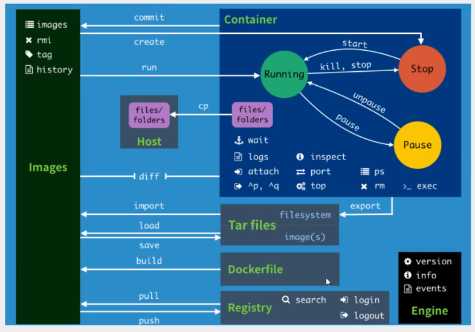
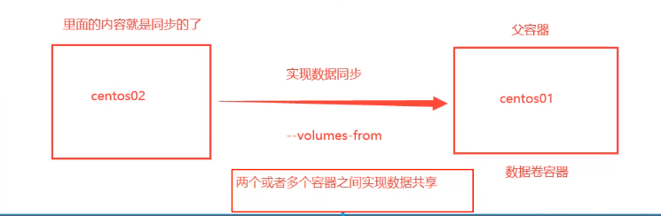

## Docker简介

## Docker 基本组成


## Docker安装

CentOS 需要 version 7以上

首先设置Repository

```shell
$ sudo yum install -y yum-utils

$ sudo yum-config-manager \
    --add-repo \
    https://download.docker.com/linux/centos/docker-ce.repo
$ yum makecache
```

安装Docker引擎

```shell
$ sudo yum install docker-ce docker-ce-cli containerd.io
```

开启服务

```shell
$ sudo systemctl start docker
```

开启helloworld

`$ sudo docker run hello-world`


`docker images` 可以查看下载的hello-world镜像


```shell
#卸载docker
$ yum remove docker-ce docker-ce-cli containerd.io
$ rm -rf /var/lib/docker
```

### Hello-World运行流程


### Docker Hub 镜像加速器

创建 /etc/docker/daemon.json

```shell
sudo mkdir -p /etc/docker
sudo tee /etc/docker/daemon.json <<-'EOF'
{
    "registry-mirrors": [
       	"https://hub-mirror.c.163.com",
        "https://mirror.ccs.tencentyun.com",
       	"https://docker.mirrors.ustc.edu.cn",
      	"https://registry.docker-cn.com",
	     "http://f1361db2.m.daocloud.io"
    ]
}
EOF
sudo systemctl daemon-reload
sudo systemctl restart docker
```


### 底层原理

**Docker是怎么工作的？**

Docker是一个Client-Server结构的系统，Docker的守护进程运行在主机上。客户端通过Socket进行访问！

Docker-Server接收到Docker-Client的指令，就会执行该指令


### Docker为什么比虚拟机快？

1. Docker有着比虚拟机更少的抽象层

2. Docker利用的是宿主机的内核，vm需要时Guest OS

    

    所以说，新建一个容器的时候，Docker不需要像虚拟机一样重新加载一个操作系统内核，避免引导。虚拟机需要加载Guest OS

## Docker的常用命令

### 帮助命令

```shell
docker version 		 # 显示docker版本信息
docker info 		 # 显示docker的系统信息，包括镜像和容器的数量
docker --help	   	 # 帮助命令
```


### 镜像命令

**docker images** 查看所有镜像

```shell
[root@localhost diff]# docker images
REPOSITORY          TAG                 IMAGE ID            CREATED             SIZE
hello-world         latest              bf756fb1ae65        10 months ago       13.3kB

```

**docker search 搜索镜像**

```shell
[root@localhost diff]# docker search mysql
NAME                              DESCRIPTION                                     STARS               OFFICIAL            AUTOMATED
mysql                             MySQL is a widely used, open-source relation…   10129               [OK]                
mariadb                           MariaDB is a community-developed fork of MyS…   3724                [OK]                
mysql/mysql-server                Optimized MySQL Server Docker images. Create…   740                                     [OK]
percona                           Percona Server is a fork of the MySQL relati…   511                 [OK]                

```

**docker pull 下载镜像**

```shell
# 下载镜像 docker pull 镜像名[:tag]
[root@localhost diff]# docker pull mysql
Using default tag: latest	# 如果不写tag，默认就是latest
latest: Pulling from library/mysql
49e22f6fb9f7: Download complete 	# 分层下载 docker image的核心 联合文件系统
842b1255668c: Download complete 
9f48d1f43000: Download complete 
c693f0615bce: Download complete 

```

**docker rmi 删除镜像**

```shell
docker rmi -f imageID #删除某一个镜像

docker rmi -f $(docker images -aq) #删除所有镜像
```

### 容器命令

**说明：我们有了镜像才可以创建容器，下载一个centos镜像来测试学习**

`docker pull centos`

**新建容器并启动**

```shell
docker run [可选参数] image

# 参数说明
--name="Name" 	容器名字 tomcat01 tomcat02 用来区分容器
-d				后台方式运行
-it 			使用交互方式运行 进入容器查看内容
-p				指定容器的端口 -p 8080:8080  这样可以跟主机的8080端口映射起来
	-p ip:主机端口：容器端口
	-p 主机端口：容器端口 （常用）
	-p 容器端口
-P				随机指定端口

#测试，启动并进入容器 
[root@localhost ~]# docker run -it centos /bin/bash
[root@b92fd94e9598 /]# ls	#查看容器内的centos 基础版本 很多命令都是不完善的
bin  dev  etc  home  lib  lib64  lost+found  media  mnt  opt  proc  root  run  sbin  srv  sys  tmp  usr  var

# 从容器中退回主机
[root@b92fd94e9598 /]# exit
exit
[root@localhost ~]# ls 
```

**列出所有运行中的容器**

```shell 
# docker ps 
		# 列出当前正在运行的容器
-a		# 列出当前正在运行的容器 以及 历史运行过的容器
-n=?	# 显示最近创建的容器 -n=1 只显示最近的1个容器
-q		# 只显示容器的ID
[root@localhost ~]# docker ps 
CONTAINER ID        IMAGE               COMMAND             CREATED             STATUS              PORTS               NAMES
[root@localhost ~]# docker ps -a
CONTAINER ID        IMAGE               COMMAND             CREATED             STATUS                     PORTS               NAMES
b92fd94e9598        centos              "/bin/bash"         6 minutes ago       Exited (0) 4 minutes ago                       boring_tesla
efd59f2024c4        hello-world         "/hello"            3 hours ago         Exited (0) 3 hours ago                         distracted_yonath
```

#### **退出容器**

```shell
exit #直接容器停止并退出
Ctrl+P+Q #容器不停止退出
```

#### **删除容器**

```shell
docker rm 容器id					 # 删除指定容器 不能删除正在运行的容器 如果要强制删除 加 -f
docker rm -f $(docker ps -aq)	  # 删除所有容器
docker ps -a -q | xargs docker rm # 删除所有容器
```

#### **启动和停止容器的操作**

```shell
docker start 容器id		#启动容器
docker restart 容器id		#重启容器
docker stop 容器id		#停止当前正在运行的容器
docker kill 容器id		#强制停止当前容器
```

### 常用其他命令

```shell
# 命令 docker run -d 镜像名
[root@localhost ~]# docker run -d centos 停止了 
# 问题docker ps 发现centos停止了 
# 常见的坑：docker 容器使用后台运行，就必须要有一个前台进程，docker发现没有应用，就会自动停止
# nginx 容器启动后 发现自己没有提供服务，就会立刻停止，就是没有程序了
```

#### **查看日志命令**

```shell
docker logs -f -t --tail 容器  没有日志

[root@localhost ~]# docker ps -a
CONTAINER ID        IMAGE               COMMAND             CREATED             STATUS                     PORTS               NAMES
57c69583e551        centos              "/bin/bash"         9 minutes ago       Exited (0) 9 minutes ago                       affectionate_pasteur
[root@localhost ~]# docker rm 57c69583e551
57c69583e551
[root@localhost ~]# docker ps -a
CONTAINER ID        IMAGE               COMMAND             CREATED             STATUS              PORTS               NAMES
[root@localhost ~]# docker run -d centos /bin/bash -c "while true;do echo linzi;sleep 1;done"
f32e72dbcae0ef9163a34833a107ab6a023891bf092900b1762abbf720412ba5
[root@localhost ~]# docker ps 
CONTAINER ID        IMAGE               COMMAND                  CREATED             STATUS              PORTS               NAMES
f32e72dbcae0        centos              "/bin/bash -c 'while…"   7 seconds ago       Up 5 seconds                            epic_mirzakhani
[root@localhost ~]# docker logs -f --tail f32e72dbcae0
"docker logs" requires exactly 1 argument.
See 'docker logs --help'.

Usage:  docker logs [OPTIONS] CONTAINER

Fetch the logs of a container
[root@localhost ~]# docker logs --htlp
unknown flag: --htlp
See 'docker logs --help'.
[root@localhost ~]# docker logs --help

Usage:	docker logs [OPTIONS] CONTAINER

Fetch the logs of a container

Options:
      --details        Show extra details provided to logs
  -f, --follow         Follow log output
      --since string   Show logs since timestamp (e.g. 2013-01-02T13:23:37) or relative (e.g. 42m for 42 minutes)
      --tail string    Number of lines to show from the end of the logs (default "all")
  -t, --timestamps     Show timestamps
      --until string   Show logs before a timestamp (e.g. 2013-01-02T13:23:37) or relative (e.g. 42m for 42 minutes)
[root@localhost ~]# docker logs -f  f32e72dbcae0
linzi
linzi
linzi
linzi
linzi
linzi
linzi
# 这里就是容器中的日志
# docker logs 这个命令会实时的更新
```

#### **查看容器中的进程信息**

```shell
docker top 容器id
```

#### **查看镜像的元数据**

```shell
docker inspect 容器id # 这个命令非常重要
[root@localhost ~]# docker inspect f32e72dbcae0
[
    {
        "Id": "f32e72dbcae0ef9163a34833a107ab6a023891bf092900b1762abbf720412ba5",
        "Created": "2020-11-02T00:33:58.78229806Z",
        "Path": "/bin/bash",
        "Args": [
            "-c",
            "while true;do echo linzi;sleep 1;done"
        ],
        "State": {
            "Status": "exited",
            "Running": false,
            "Paused": false,
            "Restarting": false,
            "OOMKilled": false,
            "Dead": false,
            "Pid": 0,
            "ExitCode": 137,
            "Error": "",
            "StartedAt": "2020-11-02T00:34:00.081372961Z",
            "FinishedAt": "2020-11-02T00:37:08.881008034Z"
        },
        "Image": "sha256:0d120b6ccaa8c5e149176798b3501d4dd1885f961922497cd0abef155c869566",
        "ResolvConfPath": "/var/lib/docker/containers/f32e72dbcae0ef9163a34833a107ab6a023891bf092900b1762abbf720412ba5/resolv.conf",
        "HostnamePath": "/var/lib/docker/containers/f32e72dbcae0ef9163a34833a107ab6a023891bf092900b1762abbf720412ba5/hostname",
        "HostsPath": "/var/lib/docker/containers/f32e72dbcae0ef9163a34833a107ab6a023891bf092900b1762abbf720412ba5/hosts",
        "LogPath": "/var/lib/docker/containers/f32e72dbcae0ef9163a34833a107ab6a023891bf092900b1762abbf720412ba5/f32e72dbcae0ef9163a34833a107ab6a023891bf092900b1762abbf720412ba5-json.log",
        "Name": "/epic_mirzakhani",
        "RestartCount": 0,
        "Driver": "overlay2",
        "Platform": "linux",
        "MountLabel": "",
        "ProcessLabel": "",
        "AppArmorProfile": "",
        "ExecIDs": null,
        "HostConfig": {
            "Binds": null,
            "ContainerIDFile": "",
            "LogConfig": {
                "Type": "json-file",
                "Config": {}
            },
            "NetworkMode": "default",
            "PortBindings": {},
            "RestartPolicy": {
                "Name": "no",
                "MaximumRetryCount": 0
            },
            "AutoRemove": false,
            "VolumeDriver": "",
            "VolumesFrom": null,
            "CapAdd": null,
            "CapDrop": null,
            "Capabilities": null,
            "Dns": [],
            "DnsOptions": [],
            "DnsSearch": [],
            "ExtraHosts": null,
            "GroupAdd": null,
            "IpcMode": "private",
            "Cgroup": "",
            "Links": null,
            "OomScoreAdj": 0,
            "PidMode": "",
            "Privileged": false,
            "PublishAllPorts": false,
            "ReadonlyRootfs": false,
            "SecurityOpt": null,
            "UTSMode": "",
            "UsernsMode": "",
            "ShmSize": 67108864,
            "Runtime": "runc",
            "ConsoleSize": [
                0,
                0
            ],
            "Isolation": "",
            "CpuShares": 0,
            "Memory": 0,
            "NanoCpus": 0,
            "CgroupParent": "",
            "BlkioWeight": 0,
            "BlkioWeightDevice": [],
            "BlkioDeviceReadBps": null,
            "BlkioDeviceWriteBps": null,
            "BlkioDeviceReadIOps": null,
            "BlkioDeviceWriteIOps": null,
            "CpuPeriod": 0,
            "CpuQuota": 0,
            "CpuRealtimePeriod": 0,
            "CpuRealtimeRuntime": 0,
            "CpusetCpus": "",
            "CpusetMems": "",
            "Devices": [],
            "DeviceCgroupRules": null,
            "DeviceRequests": null,
            "KernelMemory": 0,
            "KernelMemoryTCP": 0,
            "MemoryReservation": 0,
            "MemorySwap": 0,
            "MemorySwappiness": null,
            "OomKillDisable": false,
            "PidsLimit": null,
            "Ulimits": null,
            "CpuCount": 0,
            "CpuPercent": 0,
            "IOMaximumIOps": 0,
            "IOMaximumBandwidth": 0,
            "MaskedPaths": [
                "/proc/asound",
                "/proc/acpi",
                "/proc/kcore",
                "/proc/keys",
                "/proc/latency_stats",
                "/proc/timer_list",
                "/proc/timer_stats",
                "/proc/sched_debug",
                "/proc/scsi",
                "/sys/firmware"
            ],
            "ReadonlyPaths": [
                "/proc/bus",
                "/proc/fs",
                "/proc/irq",
                "/proc/sys",
                "/proc/sysrq-trigger"
            ]
        },
        "GraphDriver": {
            "Data": {
                "LowerDir": "/var/lib/docker/overlay2/624677b5f0defa3d320c77f978143a388f3080133e7e2889d252dd73d40f13b6-init/diff:/var/lib/docker/overlay2/ae17089ae53b5492f5225f838f20ce05c68e4467af9c825048c33a519a1c9e7c/diff",
                "MergedDir": "/var/lib/docker/overlay2/624677b5f0defa3d320c77f978143a388f3080133e7e2889d252dd73d40f13b6/merged",
                "UpperDir": "/var/lib/docker/overlay2/624677b5f0defa3d320c77f978143a388f3080133e7e2889d252dd73d40f13b6/diff",
                "WorkDir": "/var/lib/docker/overlay2/624677b5f0defa3d320c77f978143a388f3080133e7e2889d252dd73d40f13b6/work"
            },
            "Name": "overlay2"
        },
        "Mounts": [],
        "Config": {
            "Hostname": "f32e72dbcae0",
            "Domainname": "",
            "User": "",
            "AttachStdin": false,
            "AttachStdout": false,
            "AttachStderr": false,
            "Tty": false,
            "OpenStdin": false,
            "StdinOnce": false,
            "Env": [
                "PATH=/usr/local/sbin:/usr/local/bin:/usr/sbin:/usr/bin:/sbin:/bin"
            ],
            "Cmd": [
                "/bin/bash",
                "-c",
                "while true;do echo linzi;sleep 1;done"
            ],
            "Image": "centos",
            "Volumes": null,
            "WorkingDir": "",
            "Entrypoint": null,
            "OnBuild": null,
            "Labels": {
                "org.label-schema.build-date": "20200809",
                "org.label-schema.license": "GPLv2",
                "org.label-schema.name": "CentOS Base Image",
                "org.label-schema.schema-version": "1.0",
                "org.label-schema.vendor": "CentOS"
            }
        },
        "NetworkSettings": {
            "Bridge": "",
            "SandboxID": "99c0d285ba237a835ec02d6f302a6b8d9a86e082c2f07ccf567053bbec2573bd",
            "HairpinMode": false,
            "LinkLocalIPv6Address": "",
            "LinkLocalIPv6PrefixLen": 0,
            "Ports": {},
            "SandboxKey": "/var/run/docker/netns/99c0d285ba23",
            "SecondaryIPAddresses": null,
            "SecondaryIPv6Addresses": null,
            "EndpointID": "",
            "Gateway": "",
            "GlobalIPv6Address": "",
            "GlobalIPv6PrefixLen": 0,
            "IPAddress": "",
            "IPPrefixLen": 0,
            "IPv6Gateway": "",
            "MacAddress": "",
            "Networks": {
                "bridge": {
                    "IPAMConfig": null,
                    "Links": null,
                    "Aliases": null,
                    "NetworkID": "0ac9c4fd5e2d4b1d6d702edde2508dbc0262b94fa4135df57a1e32c5f989eb2a",
                    "EndpointID": "",
                    "Gateway": "",
                    "IPAddress": "",
                    "IPPrefixLen": 0,
                    "IPv6Gateway": "",
                    "GlobalIPv6Address": "",
                    "GlobalIPv6PrefixLen": 0,
                    "MacAddress": "",
                    "DriverOpts": null
                }
            }
        }
    }
]

```

#### **进入当前正在运行的容器**

```shell
# 我们通常容器都是使用后台方式运行的，需要进入容器，修改一些配置

# 命令
docker exec -it 容器id bashShell

#测试
[root@localhost ~]# docker ps
CONTAINER ID        IMAGE               COMMAND             CREATED             STATUS              PORTS               NAMES
[root@localhost ~]# docker ps -a
CONTAINER ID        IMAGE               COMMAND                  CREATED             STATUS                     PORTS               NAMES
f32e72dbcae0        centos              "/bin/bash -c 'while…"   2 hours ago         Exited (137) 2 hours ago                       epic_mirzakhani
[root@localhost ~]# docker exec -it f32e72dbcae0 /bin/bash
Error response from daemon: Container f32e72dbcae0ef is not running
[root@localhost ~]# docker start f32e72dbcae0ef
f32e72dbcae0ef9163a34833a107ab6a023891bf092900b1762abbf720412ba5
[root@localhost ~]# docker exec -it f32e72dbcae0ef /bin/bash
[root@f32e72dbcae0 /]# 

# 方式二
docker attach  容器id /bin/bash # docker exec -it 容器id bashShell 会另外开一个 bashShell
# attach 的方式会打开之前的命令行

#docker exec  		# 进入容器后开启一个新的终端，可以在里面操作(常用)
#docker attach 		# 进入容器正在执行的终端，不会启动新的进程

```

#### **从容器内拷贝文件到主机上**

```shell
docker cp 容器id:容器内路径 主机路径

[root@localhost ~]# docker start 47408c023fc5
47408c023fc5
[root@localhost ~]# docker cp 47408c023fc5:/root/hello ./
[root@localhost ~]# ls
anaconda-ks.cfg  hello  otp_src_19.3  otp_src_19.3.tar.gz  
[root@localhost ~]# cat hello 
hello docker
[root@localhost ~]#
```

### 小结




## Docker练习

### Docker安装Nginx

```shell
# 搜索镜像
[root@localhost ~]$ docker search nginx
# 下载镜像
[root@localhost ~]$ docker pull nginx:1.19.4
# 运行
docker run -d --name nginx01 -p 3344:80 nginx:1.19.4
# 测试nginx服务器是否启动
curl localhost:3344
# 查看容器内运行的进程
[root@localhost ~]$ docker top nginx02
```


我们每次修改nginx配置文件，都需要进入容器内部？ 十分的麻烦，我要是可以在容器外部提供一个映射路径，达到在容器外修改文件内容，容器内部就可以自动修改？ -v 数据卷技术

### Docker 安装Tomcat

```shell
# 官方的使用
docker run -it --rm tomcat:9.0
# 我们之前的启动都是后台，停止了容器之后，容器还是可以查到 docker run -it --rm  一般用来测试 用完即删除
Ctrl+c 之后容器就会停止 且 删除
```

## 可视化

portainer

Rancher(CI/CD的时候再用)

**什么portainer？**

Docker图形化界面管理工具！提供一个后台面板供我们操作！

```shell
docker run -d -p 8088:9000 --restart=always -v /var/run/docker.sock:/var/run/docker.sock --privileged=true portainer/portainer
```

访问测试:localhost:8088


## Docker镜像

### 镜像是什么

镜像是一种轻量级、可执行的独立软件包，用来打包软件运行环境和基于运行环境开发的软件，它包含运行某个软件所需的所有内容，包括代码、运行时、库、环境变量和配置文件。

## Docker镜像加载原理


### 分层原理


### commit镜像

```shell
docker commit 提交容器成为一个新的副本
# 命令和git原理类似
docker commit -m="提交的描述信息" -a="作者" 容器id 目标镜像名：[TAG]
```

实战：

```shell
默认启动的 tomcat webapps 是没有项目的
docker pull tomcat
docker run -it -p 8080:8080 tomcat
另外开启一个终端
docker exec -it 容器id /bin/bash
root@2a1d846ed17c:/usr/local/tomcat# cp -r webapps.dist/* webapps/
# 此时再次访问 localhost:8080 将有内容
[root@localhost ~]$ docker ps
CONTAINER ID        IMAGE               COMMAND             CREATED             STATUS              PORTS                    NAMES
2a1d846ed17c        tomcat              "catalina.sh run"   2 minutes ago       Up 2 minutes        0.0.0.0:8080->8080/tcp   gallant_jennings

# 将我们操作过的容器通过commit提交为一个镜像~ 我们以后就使用我们修改过的镜像即可
[root@localhost ~]$ docker commit -a "linzi" -m "tomcat webapps add app" 2a1d846ed17c tomcat_webapp:1.0
sha256:d722abdfac99b0de55cf78c19ee611da5a65d1c4c4533d904b384abf7cbc4134
[root@localhost ~]$ docker images
REPOSITORY            TAG                 IMAGE ID            CREATED                  SIZE
nginx                 1.19.4              c39a868aad02        Less than a second ago   133MB
nginx                 latest              c39a868aad02        Less than a second ago   133MB
tomcat                latest              35064a4fcc93        Less than a second ago   648MB
tomcat_webapp         1.0                 d722abdfac99        13 seconds ago           653MB
mysql                 latest              db2b37ec6181        10 days ago              545MB
centos                latest              0d120b6ccaa8        2 months ago             215MB
# docker images 中成功添加了 tomcat_webapp 我们的镜像了
```

## 容器数据卷

### 什么是数据卷

如果数据在容器中，那么我们容器删除，数据就会丢失~ 需求：数据可以持久化 

容器之间可以有一个数据共享的技术 Docker容器中产生的数据，同步到本地~

卷技术：其实就是目录的挂载，将我们容器内的目录，挂载到Linux上面

### 使用-v 挂载数据卷

```shell
# 方式一： 直接使用命令来挂载 -v
docker run -it -v 主机目录：容器内目录 centos /bin/bash

# 可以通过docker inspect 容器id 查看是否有挂载 "Mounts" Source Destination
```


#### 实战 安装MySQL

```shell
# 下载 MySQL5.7镜像
docker pull mysql:5.7

# 运行 MySQL5.7
docker run -d -p 3310:3306 -v /docker_data/mysql/conf:/etc/mysql/conf.d -v /docker_data/mysql/data:/var/lib/mysql -e MYSQL_ROOT_PASSWORD=123456 --name mysql5.7 mysql:5.7

```

#### 具名和匿名挂载

```shell
# 匿名挂载
-v 容器内路径
docker run -d -P --name nginx01 -v /etc/nginx nginx 匿名挂载
docker run -d -P --name nginx01 -v nameVolume:/etc/nginx nginx 具名挂载
# 通过 -v 卷名：容器类路径

# 查看所有的volume的情况
[root@localhost data]$ docker volume ls
DRIVER              VOLUME NAME
local               50a085b69b20941f7ba213f9d227c315fa09e1767ae233aff558e8f9c15ba9e3
# 这里发现 这种就是匿名挂载 我们在 -v 只写了容器内的路径，没有写容器外的路径


```


所有的docker容器内的卷，没有指定目录的情况下都是在`/var/lib/docker/volumes`目录下

我们通过具名挂载可以方便的找到我们的一个卷 大多数情况在使用的是 **具名挂载**

```shell
# 如何确定具名挂载 匿名挂载 和 指定路径挂载
-v 容器内路径		# 匿名挂载
-v 卷名（不包含/）：容器内路径 # 具名挂载
-v /宿主机路径：容器内路径 	# 指定路径挂载

# 通过 -v 容器内路径：ro/rw 改变读写权限
# 一旦设置了容器权限 容器对我们挂载出来的内容就有设定了
# ro rw是针对容器内部 只能通过宿主机来操作 容器内部无法操作
-v volumeName:/etc/nginx:ro
-v volumeName:/etc/nginx:rw 
```

### 使用Dockerfile来挂载卷

Dockerfile就是用来构建docker镜像的构建文件！其实就是命令脚本

通过这个脚本可以生产镜像 镜像是一层一层的，脚本就是一个个的命令，每个命令都是一层

```shell
# dockerfile
# 所有的命令指令都是大写
FROM centos		# 以什么为基础

VOLUME ["volume01", "volume02"]

CMD echo "---end---"
CMD /bin/bash
```

通过 `docker build -f dockerfile -t linzi/centos:1.0 . ` 来生成一个镜像linzi版的centos  注意不能少 `.`

```shell
# 构建镜像过程
[root@localhost docker]$ docker build -f ./LinziDockerFile -t linzi/centos:1.0 .
Sending build context to Docker daemon  2.048kB
Step 1/4 : FROM centos
 ---> 0d120b6ccaa8
Step 2/4 : VOLUME ["volume01", "volume02"]
 ---> Running in 09d3ecdb4a7d
Removing intermediate container 09d3ecdb4a7d
 ---> 1fac394c70a8
Step 3/4 : CMD echo "----end----"
 ---> Running in f65185f01e69
Removing intermediate container f65185f01e69
 ---> 040dcacc0f10
Step 4/4 : CMD /bin/bash
 ---> Running in ee997b7eb523
Removing intermediate container ee997b7eb523
 ---> 65b570ad1cb2
Successfully built 65b570ad1cb2
Successfully tagged linzi/centos:1.0
[root@localhost docker]$ docker images
REPOSITORY            TAG                 IMAGE ID            CREATED                  SIZE
nginx                 1.19.4              c39a868aad02        Less than a second ago   133MB
nginx                 latest              c39a868aad02        Less than a second ago   133MB
tomcat                latest              35064a4fcc93        Less than a second ago   648MB
linzi/centos          1.0                 65b570ad1cb2        43 seconds ago           215MB
tomcat_webapp         1.0                 d722abdfac99        3 hours ago              653MB
mysql                 5.7                 1b12f2e9257b        10 days ago              448MB
mysql                 latest              db2b37ec6181        10 days ago              545MB
centos                latest              0d120b6ccaa8        2 months ago             215MB
portainer/portainer   latest              62771b0b9b09        3 months ago             79.1MB
hello-world           latest              bf756fb1ae65        10 months ago            13.3kB
[root@localhost docker]$ 
```


这个卷和外部一定有一个同步的目录

挂载的目录是匿名挂载  匿名挂载直接通过 `docker volume list` 不能直观的知道宿主机的挂载路径

**可以通过 `docker inspect 容器id` 找到 Mounts 来查看**

通过这种方式挂载使用得比较多，因为我们通常会构建自己的镜像~

假设构建镜像的时候没有挂载卷，要手动挂载 使用 -v

### 数据卷容器



```shell
# 创建3个容器
# 父容器叫 docker01
docker run -it --name docker01 lizi/centos:1.0 
# 子容器 
docker run -it --name docker02 --volumes-from docker01 lizi/centos:1.0
docker run -it --name docker03 --volumes-from docker01 lizi/centos:1.0

# 测试 可以删除docker01 查看一下docker02和docker03是否还可以访问文件
# 测试结果是可以的
```

**多个mysql容器之间同步数据**

```shell
[root@localhost docker]# docker run -d -p 3310:3306 -v /etc/mysql/conf.d -v /var/lib/mysql -e MYSQL_ROOT_PASSWORD=123456 --name mysql01 mysql:5.7

[root@localhost docker]# docker run -d -p 3311:3306 -v /etc/mysql/conf.d -v /var/lib/mysql -e MYSQL_ROOT_PASSWORD=123456 --name mysql02 --volumes-from mysql01 mysql:5.7
# 这个时候 可以实现两个容器数据同步
注意mysql01 一定要有挂载的卷  --volumes-from 来能起效

```

**容器之间配置信息的传递，数据卷容器的生命周期一直持续到没有容器使用为止**

但是一旦你持久化到了本地，这个时候，本地的数据是不会删除的

## DockerFile

Dockerfile 是用来构建docker镜像的文件~ 命令参数脚本

构建步骤

1. 编写一个dockerfile文件
2. docker build构建成为一个镜像
3. docker run 运行镜像
4. docker push 发布镜像（DockerHub 阿里云镜像仓库）

很多官方镜像都是基础包，很多功能没有，我们通常会自己搭建自己的镜像~

### Dockerfile构建过程

基础知识：

1. 每个保留关键字都必须是大写字母

2. 指令是从上到下执行的

3. #表示注释

4. 每一个指令都会创建提交一个新的镜像层，并提交~

    

    dockfile是面向开发的，我们以后要发布项目，做镜像，就需要编写dockerfile文件，这个文件十分简单

    Docker镜像逐渐成为企业交付的标准，必须要掌握~

    DockerFile:构建文件，定义了一切的步骤，源代码

    DockerImages:通过DockerFile构建生成的镜像最终发布和运行的产品


### Dockerfile指令


```shell
FROM		# 基础镜像,一切从这里开始构建 centos ubuntu 
MAINTAINER	# 镜像是谁写的 姓名+邮箱
RUN			# 镜像构建的时候需要运行的命令
ADD			# 步骤：tomcat镜像 这个需要加tomcat压缩包 添加的内容
WORKDIR		# 镜像工作的目录 运行起来后默认进入的目录
VOLUME		# 挂载的目录
EXPOSE		# 暴露端口配置
CMD			# 指定这个容器启动的时候要运行的命令 只有在最后一个会生效 可被替代
ENTRYPOINT	# 指定这个容器启动的时候要运行的命令	可以追加命令
ONBUILD		# 当构建一个被 DockerFile 这个时候就会运行 ONBUILD的指令 触发指令
COPY 		# 类似ADD命令，将文件拷贝到镜像中
ENV			# 构建的时候设置环境变量
```

### 实战

Docker Hub中99%镜像都是从这个基础镜像过来的 FROM scratch，然后配置需要的软件和配置来进行构建


**创建一个自己的centos**

```shell
# 1. 编写Dockerfile的文件
root@localhost /work/docker$ cat mydockerfile_centos 
FROM centos
MAINTAINER Linzi<linzi_jxw@163.com>

ENV MYPATH /usr/local
WORKDIR $MYPATH

RUN yum -y install net-tools

EXPOSE 80

CMD echo $MYPATH
CMD echo "-----end-----"
CMD /bin/bash

# 2. 通过这个文件构建镜像
root@localhost /work/docker$ docker build -f mydockerfile_centos -t mycentos:0.1 .
Sending build context to Docker daemon  3.072kB
Step 1/9 : FROM centos
 ---> 0d120b6ccaa8
Step 2/9 : MAINTAINER Linzi<linzi_jxw@163.com>
 ---> Running in f4a784e67a08
Removing intermediate container f4a784e67a08
 ---> 41287a180260
Step 3/9 : ENV MYPATH /usr/local
 ---> Running in 2801681c33f8
Removing intermediate container 2801681c33f8
 ---> daff050049af
Step 4/9 : WORKDIR $MYPATH
 ---> Running in ce18b8fb093b
Removing intermediate container ce18b8fb093b
 ---> ef32606416e2
Step 5/9 : RUN yum -y install net-tools
 ---> Running in 28d8e4798ede
CentOS-8 - AppStream                            1.0 MB/s | 5.8 MB     00:05    
CentOS-8 - Base                                 1.5 MB/s | 2.2 MB     00:01    
CentOS-8 - Extras                               5.3 kB/s | 8.1 kB     00:01    
Dependencies resolved.
================================================================================
 Package         Architecture Version                        Repository    Size
================================================================================
Installing:
 net-tools       x86_64       2.0-0.51.20160912git.el8       BaseOS       323 k

Transaction Summary
================================================================================
Install  1 Package

Total download size: 323 k
Installed size: 1.0 M
Downloading Packages: # 下载net-tools
net-tools-2.0-0.51.20160912git.el8.x86_64.rpm   1.0 MB/s | 323 kB     00:00    
--------------------------------------------------------------------------------
Total                                           385 kB/s | 323 kB     00:00     
warning: /var/cache/dnf/BaseOS-f6a80ba95cf937f2/packages/net-tools-2.0-0.51.20160912git.el8.x86_64.rpm: Header V3 RSA/SHA256 Signature, key ID 8483c65d: NOKEY
CentOS-8 - Base                                  77 kB/s | 1.6 kB     00:00    
Importing GPG key 0x8483C65D:
 Userid     : "CentOS (CentOS Official Signing Key) <security@centos.org>"
 Fingerprint: 99DB 70FA E1D7 CE22 7FB6 4882 05B5 55B3 8483 C65D
 From       : /etc/pki/rpm-gpg/RPM-GPG-KEY-centosofficial
Key imported successfully
Running transaction check
Transaction check succeeded.
Running transaction test
Transaction test succeeded.
Running transaction
  Preparing        :                                                        1/1 
  Installing       : net-tools-2.0-0.51.20160912git.el8.x86_64              1/1 
  Running scriptlet: net-tools-2.0-0.51.20160912git.el8.x86_64              1/1 
  Verifying        : net-tools-2.0-0.51.20160912git.el8.x86_64              1/1 

Installed:
  net-tools-2.0-0.51.20160912git.el8.x86_64                                     

Complete!
Removing intermediate container 28d8e4798ede
 ---> 0eff30bb5218
Step 6/9 : EXPOSE 80
 ---> Running in eeefb9a3ef8c
Removing intermediate container eeefb9a3ef8c
 ---> 17e266d99b71
Step 7/9 : CMD echo $MYPATH
 ---> Running in 677d6bf749db
Removing intermediate container 677d6bf749db
 ---> 6a73367efe5e
Step 8/9 : CMD echo "-----end-----"
 ---> Running in 7ecf2397a980
Removing intermediate container 7ecf2397a980
 ---> 0687b1775e89
Step 9/9 : CMD /bin/bash
 ---> Running in 434d706d57f6
Removing intermediate container 434d706d57f6
 ---> f29295872658
Successfully built f29295872658
Successfully tagged mycentos:0.1

```

`docker history ImageId` 可以查看这个镜像是如何一步步构建的

**CMD 和 ENTRYPOINT 区别**

```shell
CMD			# 指定这个容器启动的时候要运行的命令 只有在最后一个会生效 可被替代
ENTRYPOINT	# 指定这个容器启动的时候要运行的命令	可以追加命令
```


通过这种方式 docker run 容器id -l 不会报错 最终运行的命令是 ls -al

## Docker 网络

