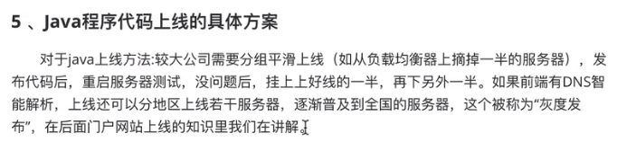
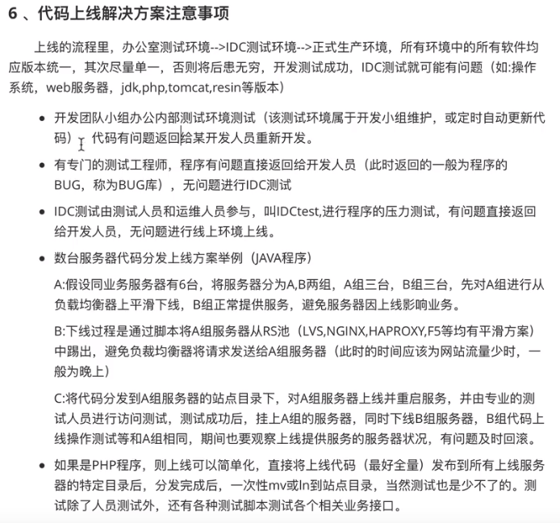

# Jenkins持续集成和持续部署实战

什么是DevOps

DevOps是一种思想或方法论，它涵盖开发、测试、运维的整个过程。DevOps强调软件开发人员、测试测试、软件运维和质量保障（QA）部门之间有效的沟通与协作，强调通过自动化的方法管理软件变更、软件集成使软件从构建到测试、发布更加快捷、可靠，最终按时交付软件。

持续集成流程


docker 下gitlab安装配置使用

```shell
# 查找Gitlab
docker search gitlab

#gitlab 镜像拉取
docker pull gitlab/gitlab-ce

# 本机建立的3个目录
# 为了gitlab容器通过挂载本机目录启动后可以映射到本机，然后后续就可以在本机查看和编辑了，不用再进容器操作

# 配置文件
mkdir -p /home/gitlab/etc

# 数据文件
mkdir -p /home/gitlab/data

# 日志文件
mkdir -p /home/gitlab/logs

# 启动容器
docker run --name "gitlab" -d -p 4443:443 -p 8888:80 -v /home/gitlab/etc:/etc/gitlab
-v /home/gitlab/data:/var/opt/gitlab -v /home/gitlab/logs:/var/log/gitlab gitlab/gitlab-ce:latest

# 查看启动日志
docker logs -f gitlab

```


Devops如何实现

设计架构规划-代码的存储-构建-测试、预生产、部署、监控


灰度发布 平滑发布 AB发布 蓝绿发布






