## 安装

```shell 
# 通过RPM包安装 需要下载如下
mysql-community-client-5.7.32-1.el7.x86_64.rpm
mysql-community-common-5.7.32-1.el7.x86_64.rpm
mysql-community-libs-5.7.32-1.el7.x86_64.rpm
mysql-community-server-5.7.32-1.el7.x86_64.rpm

# 通过yum -ivh 安装

# 安装完成后需要 启动
systemctl start mysqld

# 通过yum安装的mysqld 在/var/log/mysqld.log 存放了临时密码
# grep "password" /var/log/mysqld.log 命令获取MySQL的临时密码

# 接着就是修改密码 
mysql>  ALTER USER USER() IDENTIFIED BY '12345678';
ERROR 1819 (HY000): Your password does not satisfy the current policy requirements


```

validate_password_policy有以下取值：

| Policy          | Tests Performed                                              |
| --------------- | ------------------------------------------------------------ |
| `0` or `LOW`    | Length                                                       |
| `1` or `MEDIUM` | Length; numeric, lowercase/uppercase, and special characters |
| `2` or `STRONG` | Length; numeric, lowercase/uppercase, and special characters; dictionary file |

默认是1，即MEDIUM，所以刚开始设置的密码必须符合长度，且必须含有数字，小写或大写字母，特殊字符。

首先，修改validate_password_policy参数的值

```
mysql> set global validate_password_policy=0;
Query OK, 0 rows affected (0.00 sec)
```

其中，validate_password_number_count指定了密码中数据的长度，validate_password_special_char_count指定了密码中特殊字符的长度，validate_password_mixed_case_count指定了密码中大小字母的长度。

这些参数，默认值均为1，所以validate_password_length最小值为4，如果你显性指定validate_password_length的值小于4，尽管不会报错，但validate_password_length的值将设为4。如下所示：

[](javascript:void(0);)

```
mysql> select @@validate_password_length;
+----------------------------+
| @@validate_password_length |
+----------------------------+
|                          8 |
+----------------------------+
1 row in set (0.00 sec)

mysql> set global validate_password_length=1;
Query OK, 0 rows affected (0.00 sec)
```

修改字符集：

```shell
mysql> show variables like '%char%';
+--------------------------------------+----------------------------+
| Variable_name                        | Value                      |
+--------------------------------------+----------------------------+
| character_set_client                 | utf8                       |
| character_set_connection             | utf8                       |
| character_set_database               | latin1                     |
| character_set_filesystem             | binary                     |
| character_set_results                | utf8                       |
| character_set_server                 | latin1                     |
| character_set_system                 | utf8                       |
| character_sets_dir                   | /usr/share/mysql/charsets/ |
| validate_password_special_char_count | 1                          |
+--------------------------------------+----------------------------+
9 rows in set (0.00 sec)

```

myisam存储引擎 每个表都有3个文件：frm文件（存放表结构） myd文件（存放表数据） myi文件（存放表索引）

mysql 主要配置文件：

1. 二进制日志 log-bin
2. 错误日志 log-error
3. 查询日志 log

查看MySQL支持的存储引擎：

show engines;


```shell
# 查看默认存储引擎：
mysql> show variables like '%stora%';
+----------------------------------+--------+
| Variable_name                    | Value  |
+----------------------------------+--------+
| default_storage_engine           | InnoDB |
| default_tmp_storage_engine       | InnoDB |
| disabled_storage_engines         |        |
| internal_tmp_disk_storage_engine | InnoDB |
+----------------------------------+--------+
4 rows in set (0.01 sec)

```

MyISAM和InnoDB区别

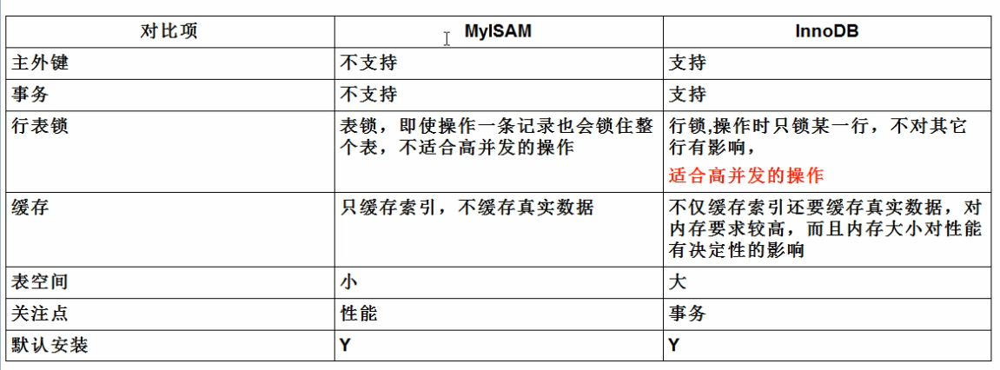

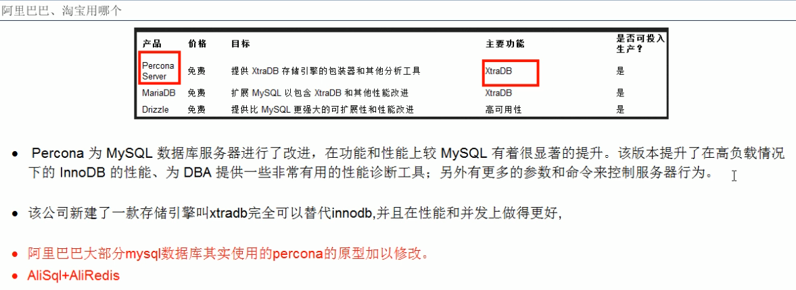

## 增删改查

### select

#### 基础查询

##### mysql 中 + 号

```mysql
#mysql中的+号：
#仅仅只有一个功能：运算符

select 100+90; 		#两个操作数都为数值型，则做加法运算
select '123'+90;	#只要其中一方为字符型，试图将字符型数值转换成数值型
					#如果转换成功，则继续做加法运算
select 'john'+90;	#如果转换失败，则将字符型数值转换成0

select null+10; 	#只要其中一方为null，则结果肯定为null
```

##### 起别名

```mysql
 /*
 ①便于理解
 ②如果要查询的字段有重名的情况，使用别名可以区分开来
 
 */
 
#方式一：使用as
SELECT 100%98 AS 结果;
SELECT last_name AS 姓,first_name AS 名 FROM employees;

#方式二：使用空格
SELECT last_name 姓,first_name 名 FROM employees;
```

##### 去重

```mysql
#案例：查询员工表中涉及到的所有的部门编号
SELECT DISTINCT department_id FROM employees;
```

#### 条件查询

```mysql
运算符：> >= < <= = != <>
逻辑运算符：	&& || ！ and or not

模糊查询： like  _ 表示匹配单个字符  % 表示匹配任意多个字符
between and
in 
is null is not null

案例：查询部门编号不是在90到110之间，或者工资高于15000的员工信息
SELECT
	*
FROM
	employees
WHERE
	NOT(department_id>=90 AND  department_id<=110) OR salary>15000;
	
#案例1：查询员工名中包含字符a的员工信息

select 
	*
from
	employees
where
	last_name like '%a%';#abc

#案例2：查询员工名中第三个字符为e，第五个字符为a的员工名和工资
select
	last_name,
	salary
FROM
	employees
WHERE
	last_name LIKE '__n_l%';

#案例3：查询员工名中第二个字符为_的员工名

SELECT
	last_name
FROM
	employees
WHERE
	last_name LIKE '_$_%' ESCAPE '$';
	
#3.in
/*
含义：判断某字段的值是否属于in列表中的某一项
特点：
	①使用in提高语句简洁度
	②in列表的值类型必须一致或兼容
	③in列表中不支持通配符
*/
#案例：查询员工的工种编号是 IT_PROG、AD_VP、AD_PRES中的一个员工名和工种编号
SELECT
	last_name,
	job_id
FROM
	employees
WHERE
	job_id IN( 'IT_PROT' ,'AD_VP','AD_PRES');
	
# is null
/*
=或<>不能用于判断null值   *****
is null或is not null 可以判断null值

select NULL = NULL; > NULL
select NULL <> NULL; > NULL
select NULL IS NULL; > 1
select NULL IS NOT NULL; 0
*/

#案例1：查询没有奖金的员工名和奖金率
SELECT
	last_name,
	commission_pct
FROM
	employees
WHERE
	commission_pct IS NULL;
	
# 安全等于 <=>
#案例1：查询没有奖金的员工名和奖金率
SELECT
	last_name,
	commission_pct
FROM
	employees
WHERE
	commission_pct <=>NULL;
	
	
#案例2：查询工资为12000的员工信息
SELECT
	last_name,
	salary
FROM
	employees

WHERE 
	salary <=> 12000;
	

#is null pk <=>

IS NULL:仅仅可以判断NULL值，可读性较高，建议使用
<=>    :既可以判断NULL值，又可以判断普通的数值，可读性较低
```

#### 排序查询

```mysql
#进阶3：排序查询
/*
语法：
select 查询列表
from 表名
【where  筛选条件】
order by 排序的字段或表达式;


特点：
1、asc代表的是升序，可以省略
desc代表的是降序

2、order by子句可以支持 单个字段、别名、表达式、函数、多个字段

3、order by子句在查询语句的最后面，除了limit子句

*/

#1、按单个字段排序
SELECT * FROM employees ORDER BY salary DESC;

#2、添加筛选条件再排序

#案例：查询部门编号>=90的员工信息，并按员工编号降序

SELECT *
FROM employees
WHERE department_id>=90
ORDER BY employee_id DESC;


#3、按表达式排序
#案例：查询员工信息 按年薪降序


SELECT *,salary*12*(1+IFNULL(commission_pct,0))
FROM employees
ORDER BY salary*12*(1+IFNULL(commission_pct,0)) DESC;


#4、按别名排序
#案例：查询员工信息 按年薪升序

SELECT *,salary*12*(1+IFNULL(commission_pct,0)) 年薪
FROM employees
ORDER BY 年薪 ASC;

#5、按函数排序
#案例：查询员工名，并且按名字的长度降序

SELECT LENGTH(last_name),last_name 
FROM employees
ORDER BY LENGTH(last_name) DESC;

#6、按多个字段排序

#案例：查询员工信息，要求先按工资降序，再按employee_id升序
SELECT *
FROM employees
ORDER BY salary DESC,employee_id ASC;
```

#### 分组查询

```mysql
/*
语法：

select 查询列表
from 表
【where 筛选条件】
group by 分组的字段
【order by 排序的字段】;

特点：
1、和分组函数一同查询的字段必须是group by后出现的字段 select list
2、筛选分为两类：分组前筛选和分组后筛选
		针对的表			位置		连接的关键字
分组前筛选	原始表				group by前	where
	
分组后筛选	group by后的结果集    		group by后	having

问题1：分组函数做筛选能不能放在where后面
答：不能

问题2：where——group by——having

一般来讲，能用分组前筛选的，尽量使用分组前筛选，提高效率

3、分组可以按单个字段也可以按多个字段
4、可以搭配着排序使用

*/


#引入：查询每个部门的员工个数

SELECT COUNT(*) FROM employees WHERE department_id=90;
#1.简单的分组

#案例1：查询每个工种的员工平均工资
SELECT AVG(salary),job_id
FROM employees
GROUP BY job_id;

#案例2：查询每个位置的部门个数

SELECT COUNT(*),location_id
FROM departments
GROUP BY location_id;


#2、可以实现分组前的筛选

#案例1：查询邮箱中包含a字符的 每个部门的最高工资

SELECT MAX(salary),department_id
FROM employees
WHERE email LIKE '%a%'
GROUP BY department_id;


#案例2：查询有奖金的每个领导手下员工的平均工资

SELECT AVG(salary),manager_id
FROM employees
WHERE commission_pct IS NOT NULL
GROUP BY manager_id;


#3、分组后筛选

#案例：查询哪个部门的员工个数>5

#①查询每个部门的员工个数
SELECT COUNT(*),department_id
FROM employees
GROUP BY department_id;

#② 筛选刚才①结果

SELECT COUNT(*),department_id
FROM employees

GROUP BY department_id

HAVING COUNT(*)>5;


#案例2：每个工种有奖金的员工的最高工资>12000的工种编号和最高工资

SELECT job_id,MAX(salary)
FROM employees
WHERE commission_pct IS NOT NULL
GROUP BY job_id
HAVING MAX(salary)>12000;


#案例3：领导编号>102的每个领导手下的最低工资大于5000的领导编号和最低工资

manager_id>102

SELECT manager_id,MIN(salary)
FROM employees
GROUP BY manager_id
HAVING MIN(salary)>5000;


#4.添加排序

#案例：每个工种有奖金的员工的最高工资>6000的工种编号和最高工资,按最高工资升序

SELECT job_id,MAX(salary) m
FROM employees
WHERE commission_pct IS NOT NULL
GROUP BY job_id
HAVING m>6000
ORDER BY m ;


#5.按多个字段分组

#案例：查询每个工种每个部门的最低工资,并按最低工资降序

SELECT MIN(salary),job_id,department_id
FROM employees
GROUP BY department_id,job_id
ORDER BY MIN(salary) DESC;
```

#### 连接查询

```mysql
/*
含义：又称多表查询，当查询的字段来自于多个表时，就会用到连接查询

笛卡尔乘积现象：表1 有m行，表2有n行，结果=m*n行

发生原因：没有有效的连接条件
如何避免：添加有效的连接条件

分类：

	按年代分类：
	sql92标准:仅仅支持内连接
	sql99标准【推荐】：支持内连接+外连接（左外和右外）+交叉连接（笛卡尔乘积）
	
	按功能分类：
		内连接：
			等值连接
			非等值连接
			自连接
		外连接：
			左外连接
			右外连接
			全外连接
		
		交叉连接


*/

SELECT * FROM beauty;

SELECT * FROM boys;


SELECT NAME,boyName FROM boys,beauty
WHERE beauty.boyfriend_id= boys.id;

#一、sql92标准
#1、等值连接
/*

① 多表等值连接的结果为多表的交集部分
②n表连接，至少需要n-1个连接条件
③ 多表的顺序没有要求
④一般需要为表起别名
⑤可以搭配前面介绍的所有子句使用，比如排序、分组、筛选
*/


#案例1：查询女神名和对应的男神名
SELECT NAME,boyName 
FROM boys,beauty
WHERE beauty.boyfriend_id= boys.id;

#案例2：查询员工名和对应的部门名

SELECT last_name,department_name
FROM employees,departments
WHERE employees.`department_id`=departments.`department_id`;


#2、为表起别名
/*
①提高语句的简洁度
②区分多个重名的字段

注意：如果为表起了别名，则查询的字段就不能使用原来的表名去限定

*/
#查询员工名、工种号、工种名

SELECT e.last_name,e.job_id,j.job_title
FROM employees  e,jobs j
WHERE e.`job_id`=j.`job_id`;


#3、两个表的顺序是否可以调换

#查询员工名、工种号、工种名

SELECT e.last_name,e.job_id,j.job_title
FROM jobs j,employees e
WHERE e.`job_id`=j.`job_id`;


#4、可以加筛选


#案例：查询有奖金的员工名、部门名

SELECT last_name,department_name,commission_pct

FROM employees e,departments d
WHERE e.`department_id`=d.`department_id`
AND e.`commission_pct` IS NOT NULL;

#案例2：查询城市名中第二个字符为o的部门名和城市名

SELECT department_name,city
FROM departments d,locations l
WHERE d.`location_id` = l.`location_id`
AND city LIKE '_o%';

#5、可以加分组


#案例1：查询每个城市的部门个数

SELECT COUNT(*) 个数,city
FROM departments d,locations l
WHERE d.`location_id`=l.`location_id`
GROUP BY city;


#案例2：查询有奖金的每个部门的部门名和部门的领导编号和该部门的最低工资
SELECT department_name,d.`manager_id`,MIN(salary)
FROM departments d,employees e
WHERE d.`department_id`=e.`department_id`
AND commission_pct IS NOT NULL
GROUP BY department_name,d.`manager_id`;
#6、可以加排序


#案例：查询每个工种的工种名和员工的个数，并且按员工个数降序

SELECT job_title,COUNT(*)
FROM employees e,jobs j
WHERE e.`job_id`=j.`job_id`
GROUP BY job_title
ORDER BY COUNT(*) DESC;


#7、可以实现三表连接？

#案例：查询员工名、部门名和所在的城市

SELECT last_name,department_name,city
FROM employees e,departments d,locations l
WHERE e.`department_id`=d.`department_id`
AND d.`location_id`=l.`location_id`
AND city LIKE 's%'

ORDER BY department_name DESC;


#2、非等值连接


#案例1：查询员工的工资和工资级别


SELECT salary,grade_level
FROM employees e,job_grades g
WHERE salary BETWEEN g.`lowest_sal` AND g.`highest_sal`
AND g.`grade_level`='A';

/*
select salary,employee_id from employees;
select * from job_grades;
CREATE TABLE job_grades
(grade_level VARCHAR(3),
 lowest_sal  int,
 highest_sal int);

INSERT INTO job_grades
VALUES ('A', 1000, 2999);

INSERT INTO job_grades
VALUES ('B', 3000, 5999);

INSERT INTO job_grades
VALUES('C', 6000, 9999);

INSERT INTO job_grades
VALUES('D', 10000, 14999);

INSERT INTO job_grades
VALUES('E', 15000, 24999);

INSERT INTO job_grades
VALUES('F', 25000, 40000);

*/


#3、自连接


#案例：查询 员工名和上级的名称

SELECT e.employee_id,e.last_name,m.employee_id,m.last_name
FROM employees e,employees m
WHERE e.`manager_id`=m.`employee_id`;


#二、sql99语法
/*
语法：
	select 查询列表
	from 表1 别名 【连接类型】
	join 表2 别名 
	on 连接条件
	【where 筛选条件】
	【group by 分组】
	【having 筛选条件】
	【order by 排序列表】
	

分类：
内连接（★）：inner
外连接
	左外(★):left 【outer】
	右外(★)：right 【outer】
	全外：full【outer】
交叉连接：cross 

*/


#一）内连接
/*
语法：

select 查询列表
from 表1 别名
inner join 表2 别名
on 连接条件;

分类：
等值
非等值
自连接

特点：
①添加排序、分组、筛选
②inner可以省略
③ 筛选条件放在where后面，连接条件放在on后面，提高分离性，便于阅读
④inner join连接和sql92语法中的等值连接效果是一样的，都是查询多表的交集


*/


#1、等值连接
#案例1.查询员工名、部门名

SELECT last_name,department_name
FROM departments d
 JOIN  employees e
ON e.`department_id` = d.`department_id`;


#案例2.查询名字中包含e的员工名和工种名（添加筛选）
SELECT last_name,job_title
FROM employees e
INNER JOIN jobs j
ON e.`job_id`=  j.`job_id`
WHERE e.`last_name` LIKE '%e%';


#3. 查询部门个数>3的城市名和部门个数，（添加分组+筛选）

#①查询每个城市的部门个数
#②在①结果上筛选满足条件的
SELECT city,COUNT(*) 部门个数
FROM departments d
INNER JOIN locations l
ON d.`location_id`=l.`location_id`
GROUP BY city
HAVING COUNT(*)>3;


#案例4.查询哪个部门的员工个数>3的部门名和员工个数，并按个数降序（添加排序）

#①查询每个部门的员工个数
SELECT COUNT(*),department_name
FROM employees e
INNER JOIN departments d
ON e.`department_id`=d.`department_id`
GROUP BY department_name

#② 在①结果上筛选员工个数>3的记录，并排序

SELECT COUNT(*) 个数,department_name
FROM employees e
INNER JOIN departments d
ON e.`department_id`=d.`department_id`
GROUP BY department_name
HAVING COUNT(*)>3
ORDER BY COUNT(*) DESC;

#5.查询员工名、部门名、工种名，并按部门名降序（添加三表连接）

SELECT last_name,department_name,job_title
FROM employees e
INNER JOIN departments d ON e.`department_id`=d.`department_id`
INNER JOIN jobs j ON e.`job_id` = j.`job_id`

ORDER BY department_name DESC;

#二）非等值连接

#查询员工的工资级别

SELECT salary,grade_level
FROM employees e
 JOIN job_grades g
 ON e.`salary` BETWEEN g.`lowest_sal` AND g.`highest_sal`;
 
 
 #查询工资级别的个数>20的个数，并且按工资级别降序
 SELECT COUNT(*),grade_level
FROM employees e
 JOIN job_grades g
 ON e.`salary` BETWEEN g.`lowest_sal` AND g.`highest_sal`
 GROUP BY grade_level
 HAVING COUNT(*)>20
 ORDER BY grade_level DESC;
 
 
 #三）自连接
 
 #查询员工的名字、上级的名字
 SELECT e.last_name,m.last_name
 FROM employees e
 JOIN employees m
 ON e.`manager_id`= m.`employee_id`;
 
  #查询姓名中包含字符k的员工的名字、上级的名字
 SELECT e.last_name,m.last_name
 FROM employees e
 JOIN employees m
 ON e.`manager_id`= m.`employee_id`
 WHERE e.`last_name` LIKE '%k%';
 
 
 #二、外连接
 
 /*
 应用场景：用于查询一个表中有，另一个表没有的记录
 
 特点：
 1、外连接的查询结果为主表中的所有记录
	如果从表中有和它匹配的，则显示匹配的值
	如果从表中没有和它匹配的，则显示null
	外连接查询结果=内连接结果+主表中有而从表没有的记录
 2、左外连接，left join左边的是主表
    右外连接，right join右边的是主表
 3、左外和右外交换两个表的顺序，可以实现同样的效果 
 4、全外连接=内连接的结果+表1中有但表2没有的+表2中有但表1没有的
 */
 #引入：查询男朋友 不在男神表的的女神名
 
 SELECT * FROM beauty;
 SELECT * FROM boys;
 
 #左外连接
 SELECT b.*,bo.*
 FROM boys bo
 LEFT OUTER JOIN beauty b
 ON b.`boyfriend_id` = bo.`id`
 WHERE b.`id` IS NULL;
 
 
 #案例1：查询哪个部门没有员工
 #左外
 SELECT d.*,e.employee_id
 FROM departments d
 LEFT OUTER JOIN employees e
 ON d.`department_id` = e.`department_id`
 WHERE e.`employee_id` IS NULL;
 
 
 #右外
 
  SELECT d.*,e.employee_id
 FROM employees e
 RIGHT OUTER JOIN departments d
 ON d.`department_id` = e.`department_id`
 WHERE e.`employee_id` IS NULL;
 
 
 #全外
 
 
 USE girls;
 SELECT b.*,bo.*
 FROM beauty b
 FULL OUTER JOIN boys bo
 ON b.`boyfriend_id` = bo.id;
 

 #交叉连接
 
 SELECT b.*,bo.*
 FROM beauty b
 CROSS JOIN boys bo;
 
 
 
 #sql92和 sql99pk
 /*
 功能：sql99支持的较多
 可读性：sql99实现连接条件和筛选条件的分离，可读性较高
 */
```

#### 子查询

```mysql
#进阶7：子查询
/*
含义：
出现在其他语句中的select语句，称为子查询或内查询
外部的查询语句，称为主查询或外查询

分类：
按子查询出现的位置：
	select后面：
		仅仅支持标量子查询
	
	from后面：
		支持表子查询
	where或having后面：★
		标量子查询（单行） √
		列子查询  （多行） √
		行子查询
		
	exists后面（相关子查询）
		表子查询
按结果集的行列数不同：
	标量子查询（结果集只有一行一列）
	列子查询（结果集只有一列多行）
	行子查询（结果集有一行多列）
	表子查询（结果集一般为多行多列）
*/


#一、where或having后面
/*
1、标量子查询（单行子查询）
2、列子查询（1列多行子查询）
3、行子查询（1行多列子查询）

特点：
①子查询放在小括号内
②子查询一般放在条件的右侧
③标量子查询，一般搭配着单行操作符使用
> < >= <= = <>

列子查询，一般搭配着多行操作符使用
in、any/some、all

④子查询的执行优先于主查询执行，主查询的条件用到了子查询的结果

*/
#1.标量子查询★

#案例1：谁的工资比 Abel 高?

#①查询Abel的工资
SELECT salary
FROM employees
WHERE last_name = 'Abel'

#②查询员工的信息，满足 salary>①结果
SELECT *
FROM employees
WHERE salary>(

	SELECT salary
	FROM employees
	WHERE last_name = 'Abel'

);

#案例2：返回job_id与141号员工相同，salary比143号员工多的员工 姓名，job_id 和工资

#①查询141号员工的job_id
SELECT job_id
FROM employees
WHERE employee_id = 141

#②查询143号员工的salary
SELECT salary
FROM employees
WHERE employee_id = 143

#③查询员工的姓名，job_id 和工资，要求job_id=①并且salary>②

SELECT last_name,job_id,salary
FROM employees
WHERE job_id = (
	SELECT job_id
	FROM employees
	WHERE employee_id = 141
) AND salary>(
	SELECT salary
	FROM employees
	WHERE employee_id = 143

);


#案例3：返回公司工资最少的员工的last_name,job_id和salary

#①查询公司的 最低工资
SELECT MIN(salary)
FROM employees

#②查询last_name,job_id和salary，要求salary=①
SELECT last_name,job_id,salary
FROM employees
WHERE salary=(
	SELECT MIN(salary)
	FROM employees
);


#案例4：查询最低工资大于50号部门最低工资的部门id和其最低工资

#①查询50号部门的最低工资
SELECT  MIN(salary)
FROM employees
WHERE department_id = 50

#②查询每个部门的最低工资

SELECT MIN(salary),department_id
FROM employees
GROUP BY department_id

#③ 在②基础上筛选，满足min(salary)>①
SELECT MIN(salary),department_id
FROM employees
GROUP BY department_id
HAVING MIN(salary)>(
	SELECT  MIN(salary)
	FROM employees
	WHERE department_id = 50
);

#非法使用标量子查询

SELECT MIN(salary),department_id
FROM employees
GROUP BY department_id
HAVING MIN(salary)>(
	SELECT  salary
	FROM employees
	WHERE department_id = 250


);


#2.列子查询（多行子查询）★
#案例1：返回location_id是1400或1700的部门中的所有员工姓名

#①查询location_id是1400或1700的部门编号
SELECT DISTINCT department_id
FROM departments
WHERE location_id IN(1400,1700)

#②查询员工姓名，要求部门号是①列表中的某一个

SELECT last_name
FROM employees
WHERE department_id  IN(
	SELECT DISTINCT department_id
	FROM departments
	WHERE location_id IN(1400,1700)
);

SELECT last_name
FROM employees
WHERE department_id  =ANY(
	SELECT DISTINCT department_id
	FROM departments
	WHERE location_id IN(1400,1700)
);

SELECT last_name
FROM employees
WHERE department_id  <>ALL(
	SELECT DISTINCT department_id
	FROM departments
	WHERE location_id IN(1400,1700)
);


#案例2：返回其它工种中比job_id为‘IT_PROG’工种任一工资低的员工的员工号、姓名、job_id 以及salary

#①查询job_id为‘IT_PROG’部门任一工资

SELECT DISTINCT salary
FROM employees
WHERE job_id = 'IT_PROG'

#②查询员工号、姓名、job_id 以及salary，salary<(①)的任意一个
SELECT last_name,employee_id,job_id,salary
FROM employees
WHERE salary<ANY(
	SELECT DISTINCT salary
	FROM employees
	WHERE job_id = 'IT_PROG'

) AND job_id<>'IT_PROG';

#或
SELECT last_name,employee_id,job_id,salary
FROM employees
WHERE salary<(
	SELECT MAX(salary)
	FROM employees
	WHERE job_id = 'IT_PROG'

) AND job_id<>'IT_PROG';


#案例3：返回其它部门中比job_id为‘IT_PROG’部门所有工资都低的员工   的员工号、姓名、job_id 以及salary

SELECT last_name,employee_id,job_id,salary
FROM employees
WHERE salary<ALL(
	SELECT DISTINCT salary
	FROM employees
	WHERE job_id = 'IT_PROG'

) AND job_id<>'IT_PROG';

#或

SELECT last_name,employee_id,job_id,salary
FROM employees
WHERE salary<(
	SELECT MIN( salary)
	FROM employees
	WHERE job_id = 'IT_PROG'

) AND job_id<>'IT_PROG';


#3、行子查询（结果集一行多列或多行多列）

#案例：查询员工编号最小并且工资最高的员工信息


SELECT * 
FROM employees
WHERE (employee_id,salary)=(
	SELECT MIN(employee_id),MAX(salary)
	FROM employees
);

#①查询最小的员工编号
SELECT MIN(employee_id)
FROM employees


#②查询最高工资
SELECT MAX(salary)
FROM employees


#③查询员工信息
SELECT *
FROM employees
WHERE employee_id=(
	SELECT MIN(employee_id)
	FROM employees


)AND salary=(
	SELECT MAX(salary)
	FROM employees

);


#二、select后面
/*
仅仅支持标量子查询
*/

#案例：查询每个部门的员工个数


SELECT d.*,(

	SELECT COUNT(*)
	FROM employees e
	WHERE e.department_id = d.`department_id`
 ) 个数
 FROM departments d;
 
 
 #案例2：查询员工号=102的部门名
 
SELECT (
	SELECT department_name,e.department_id
	FROM departments d
	INNER JOIN employees e
	ON d.department_id=e.department_id
	WHERE e.employee_id=102
	
) 部门名;


#三、from后面
/*
将子查询结果充当一张表，要求必须起别名
*/

#案例：查询每个部门的平均工资的工资等级
#①查询每个部门的平均工资
SELECT AVG(salary),department_id
FROM employees
GROUP BY department_id


SELECT * FROM job_grades;


#②连接①的结果集和job_grades表，筛选条件平均工资 between lowest_sal and highest_sal

SELECT  ag_dep.*,g.`grade_level`
FROM (
	SELECT AVG(salary) ag,department_id
	FROM employees
	GROUP BY department_id
) ag_dep
INNER JOIN job_grades g
ON ag_dep.ag BETWEEN lowest_sal AND highest_sal;


#四、exists后面（相关子查询）

/*
语法：
exists(完整的查询语句)
结果：
1或0
*/

SELECT EXISTS(SELECT employee_id FROM employees WHERE salary=300000);

#案例1：查询有员工的部门名

#in
SELECT department_name
FROM departments d
WHERE d.`department_id` IN(
	SELECT department_id
	FROM employees

)

#exists

SELECT department_name
FROM departments d
WHERE EXISTS(
	SELECT *
	FROM employees e
	WHERE d.`department_id`=e.`department_id`
);


#案例2：查询没有女朋友的男神信息

#in

SELECT bo.*
FROM boys bo
WHERE bo.id NOT IN(
	SELECT boyfriend_id
	FROM beauty
)

#exists
SELECT bo.*
FROM boys bo
WHERE NOT EXISTS(
	SELECT boyfriend_id
	FROM beauty b
	WHERE bo.`id`=b.`boyfriend_id`

);
```


### 查询原理.

​	先 连接 根据 ON 连接条件过滤一部分数据 再 根据Where再过滤一部分数据  接着 分组  分组后根据having来进一步过滤数据，最后根据 ORDER BY 进行数据排序 最后才通过select list进行输出

## 函数

### 常见函数

```mysql
/*

概念：类似于java的方法，将一组逻辑语句封装在方法体中，对外暴露方法名
好处：1、隐藏了实现细节  2、提高代码的重用性
调用：select 函数名(实参列表) 【from 表】;
特点：
	①叫什么（函数名）
	②干什么（函数功能）

分类：
	1、单行函数
	如 concat、length、ifnull等
	2、分组函数
	
	功能：做统计使用，又称为统计函数、聚合函数、组函数
	
常见函数：
	一、单行函数
	字符函数：
	length:获取字节个数(utf-8一个汉字代表3个字节,gbk为2个字节)
	concat
	substr
	instr
	trim
	upper
	lower
	lpad
	rpad
	replace
	
	数学函数：
	round
	ceil
	floor
	truncate
	mod
	
	日期函数：
	now
	curdate
	curtime
	year
	month
	monthname
	day
	hour
	minute
	second
	str_to_date
	date_format
	其他函数：
	version
	database
	user
	控制函数
	if
	case


	

*/


#一、字符函数

#1.length 获取参数值的字节个数
SELECT LENGTH('john'); > 4
SELECT LENGTH('张三丰'); > 9

SHOW VARIABLES LIKE '%char%'

#2.concat 拼接字符串

SELECT CONCAT(last_name,'_',first_name) 姓名 FROM employees;

#3.upper、lower
SELECT UPPER('john');
SELECT LOWER('joHn');
#示例：将姓变大写，名变小写，然后拼接
SELECT CONCAT(UPPER(last_name),LOWER(first_name))  姓名 FROM employees;

#4.substr、substring
注意：索引从1开始
#截取从指定索引处后面所有字符
SELECT SUBSTR('李莫愁爱上了陆展元',7)  out_put;

#截取从指定索引处指定字符长度的字符
SELECT SUBSTR('李莫愁爱上了陆展元',1,3) out_put;


#案例：姓名中首字符大写，其他字符小写然后用_拼接，显示出来

SELECT CONCAT(UPPER(SUBSTR(last_name,1,1)),'_',LOWER(SUBSTR(last_name,2)))  out_put
FROM employees;

#5.instr 返回子串第一次出现的索引，如果找不到返回0

SELECT INSTR('杨不殷六侠悔爱上了殷六侠','殷八侠') AS out_put;

#6.trim

SELECT LENGTH(TRIM('    张翠山    ')) AS out_put;

SELECT TRIM('aa' FROM 'aaaaaaaaa张aaaaaaaaaaaa翠山aaaaaaaaaaaaaaaaaaaaaaaaaaaaaaaaaaaaa')  AS out_put;

#7.lpad 用指定的字符实现左填充指定长度

SELECT LPAD('殷素素',2,'*') AS out_put;

#8.rpad 用指定的字符实现右填充指定长度

SELECT RPAD('殷素素',12,'ab') AS out_put;


#9.replace 替换

SELECT REPLACE('周芷若周芷若周芷若周芷若张无忌爱上了周芷若','周芷若','赵敏') AS out_put;


#二、数学函数

#round 四舍五入
SELECT ROUND(-1.55);
SELECT ROUND(1.567,2);


#ceil 向上取整,返回>=该参数的最小整数

SELECT CEIL(-1.02);

#floor 向下取整，返回<=该参数的最大整数
SELECT FLOOR(-9.99);

#truncate 截断

SELECT TRUNCATE(1.69999,1);

#mod取余
/*
mod(a,b) ：  a-a/b*b

mod(-10,-3):-10- (-10)/(-3)*（-3）=-1
*/
SELECT MOD(10,-3);
SELECT 10%3;


#三、日期函数

#now 返回当前系统日期+时间
SELECT NOW();

#curdate 返回当前系统日期，不包含时间
SELECT CURDATE();

#curtime 返回当前时间，不包含日期
SELECT CURTIME();


#可以获取指定的部分，年、月、日、小时、分钟、秒
SELECT YEAR(NOW()) 年;
SELECT YEAR('1998-1-1') 年;

SELECT  YEAR(hiredate) 年 FROM employees;

SELECT MONTH(NOW()) 月;
SELECT MONTHNAME(NOW()) 月;


#str_to_date 将字符通过指定的格式转换成日期

SELECT STR_TO_DATE('1998-3-2','%Y-%c-%d') AS out_put;

#查询入职日期为1992--4-3的员工信息
SELECT * FROM employees WHERE hiredate = '1992-4-3';

SELECT * FROM employees WHERE hiredate = STR_TO_DATE('4-3 1992','%c-%d %Y');


#date_format 将日期转换成字符

SELECT DATE_FORMAT(NOW(),'%y年%m月%d日') AS out_put;

#查询有奖金的员工名和入职日期(xx月/xx日 xx年)
SELECT last_name,DATE_FORMAT(hiredate,'%m月/%d日 %y年') 入职日期
FROM employees
WHERE commission_pct IS NOT NULL;


#四、其他函数

SELECT VERSION();
SELECT DATABASE();
SELECT USER();


#五、流程控制函数
#1.if函数： if else 的效果

SELECT IF(10<5,'大','小');

SELECT last_name,commission_pct,IF(commission_pct IS NULL,'没奖金，呵呵','有奖金，嘻嘻') 备注
FROM employees;


#2.case函数的使用一： switch case 的效果

/*
java中
switch(变量或表达式){
	case 常量1：语句1;break;
	...
	default:语句n;break;


}

mysql中

case 要判断的字段或表达式
when 常量1 then 要显示的值1或语句1;
when 常量2 then 要显示的值2或语句2;
...
else 要显示的值n或语句n;
end
*/

/*案例：查询员工的工资，要求

部门号=30，显示的工资为1.1倍
部门号=40，显示的工资为1.2倍
部门号=50，显示的工资为1.3倍
其他部门，显示的工资为原工资

*/


SELECT salary 原始工资,department_id,
CASE department_id
WHEN 30 THEN salary*1.1
WHEN 40 THEN salary*1.2
WHEN 50 THEN salary*1.3
ELSE salary
END AS 新工资
FROM employees;


#3.case 函数的使用二：类似于 多重if
/*
java中：
if(条件1){
	语句1；
}else if(条件2){
	语句2；
}
...
else{
	语句n;
}

mysql中：

case 
when 条件1 then 要显示的值1或语句1
when 条件2 then 要显示的值2或语句2
。。。
else 要显示的值n或语句n
end
*/

#案例：查询员工的工资的情况
如果工资>20000,显示A级别
如果工资>15000,显示B级别
如果工资>10000，显示C级别
否则，显示D级别


SELECT salary,
CASE 
WHEN salary>20000 THEN 'A'
WHEN salary>15000 THEN 'B'
WHEN salary>10000 THEN 'C'
ELSE 'D'
END AS 工资级别
FROM employees;

```


### 分组函数

```mysql
/*
功能：用作统计使用，又称为聚合函数或统计函数或组函数

分类：
sum 求和、avg 平均值、max 最大值 、min 最小值 、count 计算个数

特点：
1、sum、avg一般用于处理数值型
   max、min、count可以处理任何类型
2、以上分组函数都忽略null值

3、可以和distinct搭配实现去重的运算

4、count函数的单独介绍
一般使用count(*)用作统计行数 

5、和分组函数一同查询的字段要求是group by后的字段
*/


#1、简单 的使用
SELECT SUM(salary) FROM employees;
SELECT AVG(salary) FROM employees;
SELECT MIN(salary) FROM employees;
SELECT MAX(salary) FROM employees;
SELECT COUNT(salary) FROM employees;


SELECT SUM(salary) 和,AVG(salary) 平均,MAX(salary) 最高,MIN(salary) 最低,COUNT(salary) 个数
FROM employees;

SELECT SUM(salary) 和,ROUND(AVG(salary),2) 平均,MAX(salary) 最高,MIN(salary) 最低,COUNT(salary) 个数
FROM employees;

#2、参数支持哪些类型

SELECT SUM(last_name) ,AVG(last_name) FROM employees;
SELECT SUM(hiredate) ,AVG(hiredate) FROM employees;

SELECT MAX(last_name),MIN(last_name) FROM employees;

SELECT MAX(hiredate),MIN(hiredate) FROM employees;

SELECT COUNT(commission_pct) FROM employees;
SELECT COUNT(last_name) FROM employees;

#3、是否忽略null
# 会忽略
SELECT SUM(commission_pct) ,AVG(commission_pct),SUM(commission_pct)/35,SUM(commission_pct)/107 FROM employees;

SELECT MAX(commission_pct) ,MIN(commission_pct) FROM employees;

SELECT COUNT(commission_pct) FROM employees;
SELECT commission_pct FROM employees;


#4、和distinct搭配

SELECT SUM(DISTINCT salary),SUM(salary) FROM employees;

SELECT COUNT(DISTINCT salary),COUNT(salary) FROM employees;


#5、count函数的详细介绍

SELECT COUNT(salary) FROM employees;


SELECT COUNT(*) FROM employees;

SELECT COUNT(1) FROM employees;

效率：
MYISAM存储引擎下  ，COUNT(*)的效率高 因为直接使用的一个内部计数器
INNODB存储引擎下，COUNT(*)和COUNT(1)的效率差不多，比COUNT(字段)要高一些 因为count(字段) 会判断值是否为null


#6、和分组函数一同查询的字段有限制

SELECT AVG(salary),employee_id  FROM employees;
```


## 索引优化

性能下降SQL慢

	1. 执行时间长
	2. 等待时间长

可能的原因：

1. 查询语句写得烂
2. 索引失效 单值索引 和复合索引
3. 关联查询太多join
4. 服务器调优及各个参数设置（缓冲、线程数等)


create index idx_user_name on user(name);

```mysql
#写SQL:
SELECT DISTINCT
	<select_list>
FROM
	<left_table> <join_type>
JOIN <right_table> ON <join_condition>
WHERE
	<where_condition>
GROUP BY
	<group_by_list>
HAVING
	<having_condition>
ORDER BY
	<order_by_condition>
LIMIT <limit number>

# 机器解析SQL
FROM <left_table>
ON <join_condition>
<join_type> JOIN <right_table>
WHERE <where_condition>
GROUP BY <group_by_list>
HAVING <having_condition>
SELECT
DISTINCT <select_list>
ORDER BY <order_by_condition>
LIMIT <limit_number>

```

判断字段is null 和 is not null

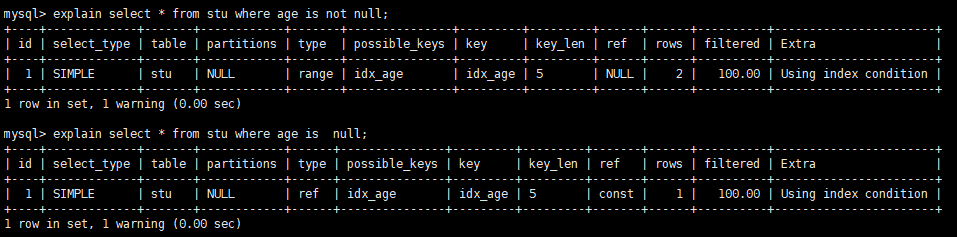

### 索引

```shell
Innode 节点的大小
SHOW GLOBAL STATUS like 'Innode_page_size';
16384 16kb

bigint 是8个字节 指针是6个字节
一个innode节点可以存放 16kb/(8+6) = 1170 个索引
然后一个行数据占用1kb的话
三层树结构 可以存放 1170* 1170 * 16 =21,902,400 行
最多经过3次IO

mysql中根节点是常驻内存的
几千万行的表 可能也就经过1-2次的磁盘IO查找到我们需要的元素
```


为什么InnoDB表必须有主键 因为innodb是根据主键来组织整张表的数据 使用聚簇索引（索引和数据存放在一起）

如果我们创建的表结构没有提供主键 那么MySQL会将从前往后所以唯一的列 将这列作为主键

如果没有 那么mysql会为我们创建6个字节的rowid作为我们的主键

## 日志

```shell
错误日志
执行日志
慢查询日志

binlog	mysql服务器
undo log	innodb存储引擎
redo log 	innodb存储引擎
relay log
```


## 优化

监控SQL 看SQL执行时间 执行过程中占用多少资源

MySQL连接数量

数据库设计之初需要考虑索引设计的问题

SQL语句优化

设置MySQL的参数

分布式集群该如何设计

## 复制

一主一从

主主复制

一主多从

多主一从

级联复制

### 主从复制延迟产生的原因有哪些？

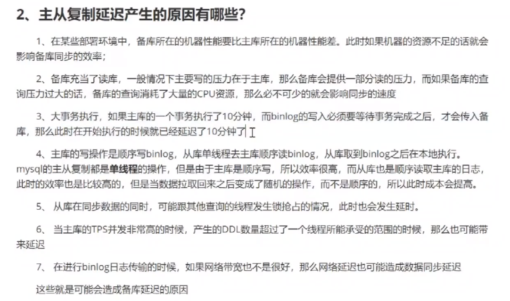

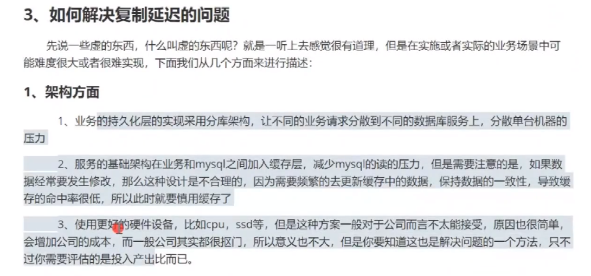


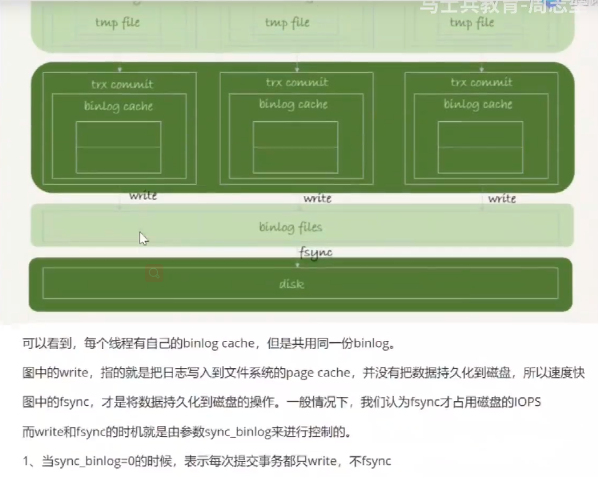


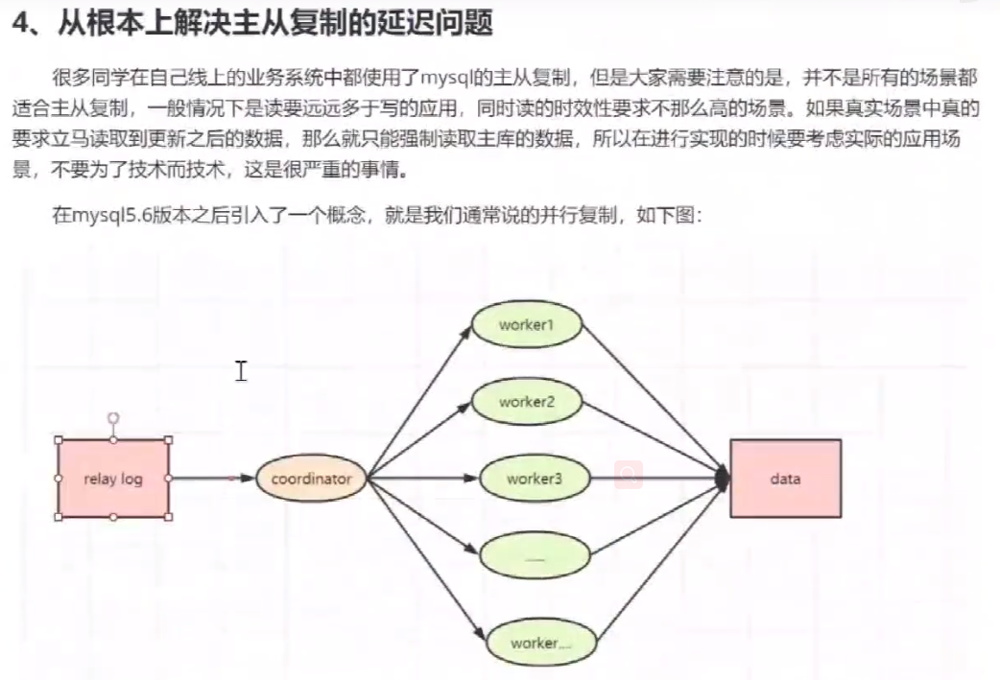


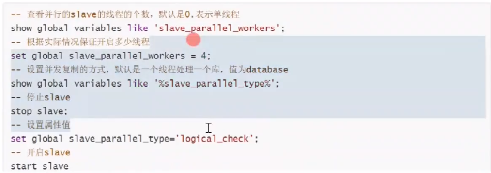

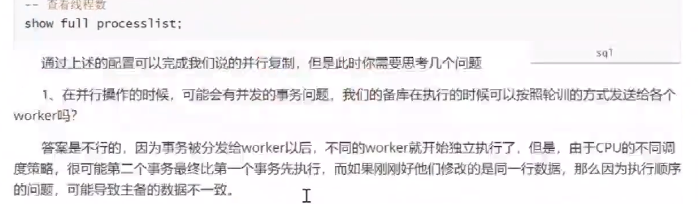

## 锁

乐观锁（通过设置版本号进行判断）悲观锁（通过加锁 读写锁）

锁分为行锁和表锁

MyISAM存储引擎只支持表锁

```mysql
# 加表锁
lock table mylock read; # 加读锁
lock table mylock write;# 加写锁
unlock table;	 # 释放表锁
show open table; # 锁住的表 在 In_use 一列 值为 1

# MyISAM 锁行为分析
# 读锁 
#    当前session能select 但是update delete insert 会报如下错误
#    	ERROR 1099 (HY000): Table 'mylock' was locked with a READ lock and
#       can't be updated
#    其他session 能select 但是 update delete insert 被阻塞 直到表锁释放

# 写锁
# 	 当前session 能select 能update delete insert
#    其他session 不能select update delete insert

# InnoDB 支持 事务 行锁 并发度高 锁粒度小
```

## 事务

事务具有以下4个属性：ACID

原子性（Atomicity）

一致性（Consistent）

隔离性（Isolation）

持久性（Durable）


### 并发事务处理带来的问题

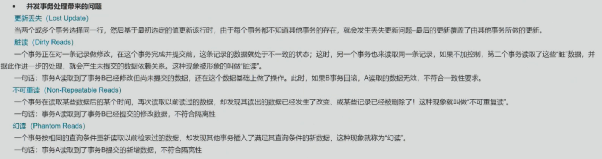

### 事务隔离级别

| 隔离级别                   | 脏读(Dirty Read) | 不可重复读(NonRepeatable Read) | 幻读(Phantom Read) |
| -------------------------- | ---------------- | ------------------------------ | ------------------ |
| 读未提交(Read uncommitted) | 可能             | 可能                           | 可能               |
| 读已提交(Read committed)   | 不可能           | 可能                           | 可能               |
| 可重复读(Repeatable)       | 不可能           | 不可能                         | 可能               |
| 可串行化(Serializable)     | 不可能           | 不可能                         | 不可能             |

数据库的事务隔离越严格，并发副作用越小，但付出的代价也就越大，因为事务隔离实质上就是使事务在一定程度中“串行化”进行，这显然与并发是矛盾的。

同时，不用的应用对读一致性和事务隔离程度的要求也是不同的，比如许多应用对“不可重复读”和“幻读”并不敏感，可能更关心数据并发访问的能力。

### 查看与设置数据库事务隔离级别

```mysql
show variables like 'tx_isolation';
set tx_isolation='REPEATABLE-READ';

set autocommit=0;
begin;
```

**当两个事务同时对一行数据修改的时候，后修改的事务被阻塞 不管当前处于什么事务隔离级别 **

**阻塞超时在哪里设置呢？**

**所以这就可能导致死锁 那么应该如何避免呢？**


### MVCC机制

可重复读的隔离级别下使用了MVCC（Multi-Version Concurrency Control）机制，select操作不会更新版本号，是快照读(历史版本)；insert、update和delete会更新版本号，是当前读(当前版本)

因此在可重复读隔离级别中 修改数据都是基于当前最新的数据修改 

比如： update class set count = count - 50 where id = 1;  并不是根据在当前会话一开始select查询的结构进行计算  而是根据当前数据库最新的值进行计算。

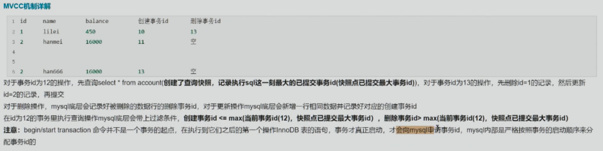

**只有执行到第一个操作InnoDB表的语句，事务才真正启动，才向mysql申请事务id，mysql内部严格按照事务的启动顺序来分配事务id的**


### 锁定某一行

锁定某一行还可以用lock in share mode（共享锁）和 for update（排它锁） 

select * from test_innodb_lock where a = 2 for update;

这样其他session只能读这行数据，修改则会被阻塞，知道锁定行的session提交


### 行锁分析

通过检查InnoDB_row_lock 状态变量来分析系统上的行锁的争夺情况

show status like 'innodb_row_lock%';

对各个状态量的说明如下：

Innodb_row_lock_current_waits: 当前正在等待锁定的刷领

Innodb_row_lock_time:从系统启动到现在锁定总时间长度

Innodb_row_lock_avg: 每次等待所花平均时间

Innodb_row_lock_time_max: 从系统启动到现在等待最长的一次所花时间

Innodb_row_lock_waits: 系统启动后到现在总共等待的次数

### 死锁情况

Session 1: select * from account where id=1 for update;

Session 2: select * from account where id=2 for update;

Session 2: select * from account where id=1 for update;

Session 1: select * from account where id=2 for update;

**查看近期死锁日志信息：show engine innodb status \G**;

大多数情况mysql可以自动检测死锁并回滚产生死锁的那个事务，但是有些情况没法自动检测死锁

如上：mysql 会直接将导致死锁的Session1直接回滚

### 优化建议

1. 尽可能让所有数据检索都通过索引来完成，避免无索引起行锁升级为表锁

2. 合理设计索引，尽量缩小锁的范围

3. 尽可能减少检索条件范围，避免间隙锁

4. 尽量控制事务大小，减少锁定资源量和时间长度，设计事务加锁的sql尽量放在事务最后执行

5. 尽可能低级别事务隔离

    

## 问题集合

### count(*) 与 count（id）速度比较

count(id) 会判断id是否为NULL 因此速度会有所下降

什么是索引 什么时候该建立索引 什么时候不能建索引 建完索引是如何保证索引不失效的

效率：

​	MYISAM存储引擎下，COUNT(*)的效率高，因为直接返回一个内部计数器的值

​	INNODB存储引擎下，COUNT(*)和COUNT(1)的效率差不多，比COUNT(字段)要高一些，因为COUNT(字段)会判断字段值是否为NULL，不为NULL才加1