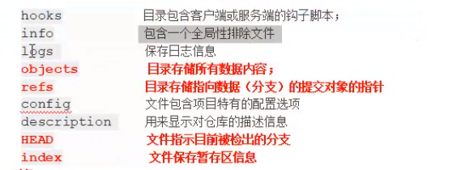
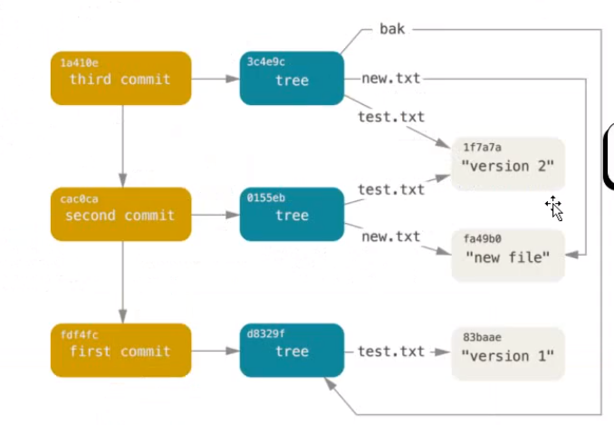
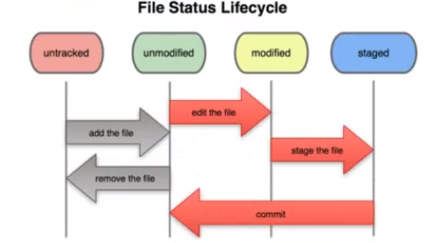
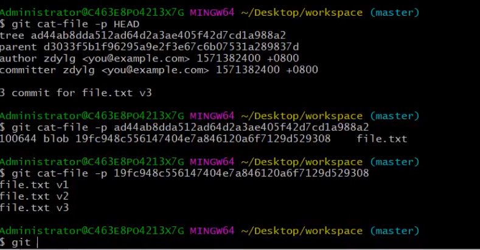
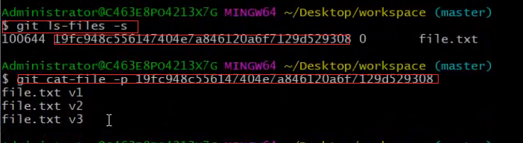
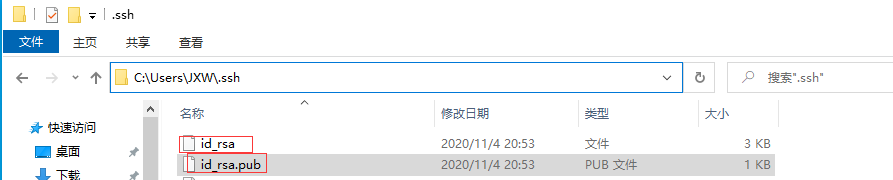
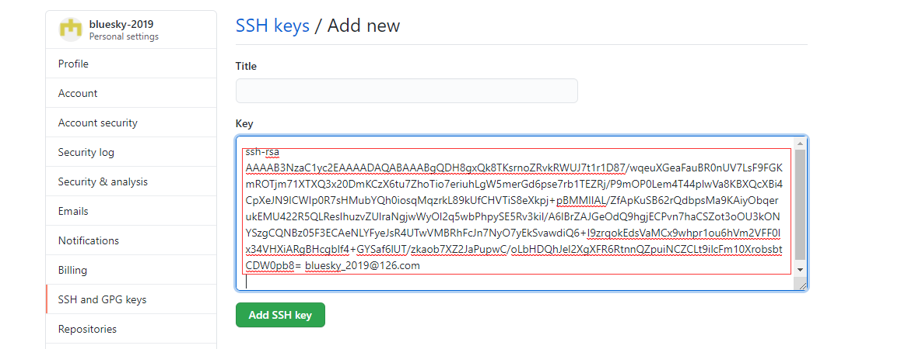
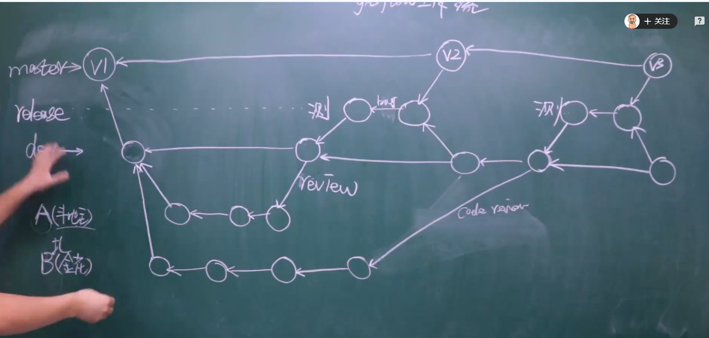

# git学习笔记

## Git特点

1. 直接记录快照，而非差异比较
2. 近乎所有操作都是本地执行
3. 时刻保持数据完整性
4. 多数操作仅添加数据
5. 文件的三种状态

## 配置

### 配置基本信息

/etc/gitconfig文件：

​	系统中对所有用户都普遍适用的配置  使用git config --system 读写的就是这个文件

~/.gitconfig文件：

​	用户目录下的配置文件只适用于该用户 使用 git config --global 读写的就是这个文件

.git/config文件：

​	当前项目的Git目录中的配置文件（也就是工作目录中的.git/config文件） 这里的配置仅仅针对当前项目有效

例子：

配置个人的用户名和电子邮件地址

git config --global user.name "linzi"

git config --global user.email "linzi_jxw@163.com"

查看已有配置

git config --list


基础命令：

​	git init 初始化仓库

​	初始化后的目录结构



### 配置命令别名

```shell
git config --global alias.co checkout
git config --global alias.br branch
git config --global alias.ci commit
```

### 配置忽略某些文件

创建一个名为.gitignore的文件，列出要忽略的文件模式

格式规范

 1. 所有空行或者以注释符号#开头的行都会被Git忽略

 2. 可以使用标准的glob模式匹配

     1. *代表匹配任意个字符

     2. ？代表匹配任意一个字符

     3. **代表匹配多级目录

        匹配模式前跟反斜杠（/）这个斜杠代表项目根目录

        匹配模式最后跟分斜杠（/）说明要忽略的是目录

        要忽略指定模式以外的文件或目录，可以在模式前加上（！）取反

        例子：

        1. /dist/ 忽略根目录下的dist目录
        2. node_modules/ 不管在根目录还是子目录中 node_modules都被忽略
        3. *.a    !lib.a  忽略所有.a结尾的文件但是lib.a除外


## git底层操作

### 区域

#### 工作区

#### 暂存区

#### 版本库


### 对象

#### Git对象

​		Git的核心部分是一个简单的键值对数据库。你可以向该数据库插入任意类型的内容，它会返回一个键值，通过该键值可以在任意时刻再次检索该内容。git对象是key-value组成的键值对（key是val对应的hash）键值对在git内部是一个blob类型

​	向数据库写入内容 并返回对应键值对

```shell
$ echo 'test content' | git hash-object -w --stdin
d670460b4b4aece5915caf5c68d12f560a9fe3e4
	-w 选项指示 hash-object命令存储数据对象；若不指定此选项，则该命令仅返回对应的键值
	--stdin 选项指示该命令从标准输入读取内容；若不指定此选项，则须在命令尾部给出待存储文件的路径
	返回：该命令输出一个长度为40个字符的校验和 这是一个SHA-A哈希值
	
$ find .git/objects/ -type f
.git/objects/d6/70460b4b4aece5915caf5c68d12f560a9fe3e4
	查看如果存储该内容的
	
JXW@DESKTOP-7ENRA1S MINGW64 ~/Desktop/LearnGit (master)
$ git cat-file -p d670460b4b4aece5915caf5c68d12f560a9fe3e4
test content
	根据键值拉取数据
	-p 选项可指示该命令自动判断内容的类型，并为我们现实格式友好的内容
	-t 输出该内容的类型
	利用cat-file -t命令可以让Git告诉我们其内部存储的任何对象类型
	返回：blob
	
```

​	

#### 树对象

​	git对象存在一个问题 记住文件的每一个版本所对应的SHA-1值并不现实 在Git中，文件名并没有被保存仅保存了文件的内容 解决方案：树对象

​	树对象（tree object)，它能解决文件名保存的问题，也允许我们将多个文件组织到一起 Git以一种类似于UNIX文件系统的方式存储内容。所有内容以树对象和数据对象（git对象）的形式存储，其中树对象对应了UNIX中的目录项，数据对象(git对象)则大致上对应文件内容。一个树对象包含了一条或多条记录（每条记录含有一个指向git对象或者子树对象的SHA-1指针，以及相应的模式、类型、文件名信息）一个树对象也可以包含另一个树对象。

查看树对象

命令：

​	git cat-file -p master^{tree}

​	master^{tree}语法表示master分支上最新的提交所指向的树对象

#### 构建树对象

我们可以通过update-index;write-tree;read-tree等命令来构建树对象并塞入暂存区

```shell
JXW@DESKTOP-7ENRA1S MINGW64 ~/Desktop/LearnGit (master)
$ echo "Hello Git" > test.txt

JXW@DESKTOP-7ENRA1S MINGW64 ~/Desktop/LearnGit (master)
$ git hash-object -w test.txt
warning: LF will be replaced by CRLF in test.txt.
The file will have its original line endings in your working directory
9f4d96d5b00d98959ea9960f069585ce42b1349a

JXW@DESKTOP-7ENRA1S MINGW64 ~/Desktop/LearnGit (master)
$ git update-index --add --cacheinfo 100644 9f4d96d5b00d98959ea9960f069585ce42b1349a test.txt

JXW@DESKTOP-7ENRA1S MINGW64 ~/Desktop/LearnGit (master)
$ git write-tree 给暂存区做一个快照 生成一个树对象 放到数据库里面进去
43bd1cff5fe2dcc90c3c0b4c66c9a5c19175e617

文件模式为 	100644 普通文件
		   100755 可执行文件
           120000 符号链接 
--add选项
	因为此前文件并不在暂存区中首次需要 --add
--cacheinfo选项
	因为将要添加的文件位于git数据库中，而不是位于当前目录下 所以需要--cacheinfo 
	

查看暂存区当前的样子
	git ls-files -s

git update-index --add new.txt
	将合并 git hash-object -w new.txt 和
	git update-index --cacheinfo xxxhashcode new.txt 
	
将第一个树对象加入第二个树对象，使其成为新的树对象
命令：
	git read-tree --prefix=bak 43bd1cff5fe2dcc90c3c0b4c66c9a5c19175e617
	git write-tree
	read-tree命令 可以把树对象读入暂存区

```

#### 提交对象

我们可以通过调用commit-tree命令创建一个提交对象，为此需要制定一个树对象的SHA-1值，以及该提交的父提交对象（如果有的话 第一次将暂存区做快照就没有父对象）

创建提交对象

```shell
echo 'first commit' | git commit-tree 43bd1cff5fe2dcc90c3c0b4c66c9a5c19175e617
```




**一个提交对象 对应一个树对象 一个树对象可以包含多个git对象**

## Git高层操作

git init


`git add filename`  将新文件添加到暂存区

`git add ./`				将当前修改添加到暂存区

`git commit -m` "版本的注释信息"


工作目录下面的所有文件两种状态：**已跟踪** 或 **未跟踪**

已跟踪的文件是指本来就被纳入版本控制管理的文件，在上次快照中有它们的记录，工作一段时间后，它们的状态可能是 **已提交** **已修改** **已暂存**



检查当前文件状态

`git status `


## 命令总结

### 通用命令

git init				初始化版本库

git status			查看工作状态

git diff				查看当前做的哪些更新还没有暂存 工作区中的与暂存区的做对比

git diff --cached

git diff -staged	有哪些更新已经暂存起来准备好了下次提交 暂存区中的与版本库的做对比


#### 删除

1. 工作区先 rm 文件
2. git add ./ 将修改提交暂存区
3. git commit -m 完成提交
4. 或者直接 git rm(省略 1 和2)

#### 改名

1. git mv old.txt new.txt

       git mv 相当于运行了下面三条命令

    1.  mv old.txt new.txt
    2. git rm old.txt
    3. git add new.txt

2. git commit -m

    

#### 查看历史记录

```shell
JXW@DESKTOP-7ENRA1S MINGW64 ~/Desktop/LearnGit (master)
$ git log
commit b6c1cdf865b454a889472547e88d68e8fc1bbd3d (HEAD -> master)
Author: linzi <linzi_jxw@163.com>
Date:   Mon Nov 2 21:20:02 2020 +0800

    add new.txt

commit e23400a229cd75d3cf2ebd440ddd55f8b6e472e1
Author: linzi <linzi_jxw@163.com>
Date:   Mon Nov 2 18:40:03 2020 +0800

    first commit

commit f64326ecf7316e515cef1549d523d07e20a035bf
Author: linzi <linzi_jxw@163.com>
Date:   Mon Nov 2 18:39:14 2020 +0800

    first commit

```

git log 会按提交时间列出所有的更新，最近的排在最上面

git log --pretty=oneline

git log --oneline		与上一样大致一样 除了 SHA-1显示变短

#### 查看更多历史记录

```shell
JXW@DESKTOP-7ENRA1S MINGW64 ~/Desktop/LearnGit (testing)
$ git reflog
95ba5bc (HEAD -> testing) HEAD@{0}: checkout: moving from master to testing
b6c1cdf (master) HEAD@{1}: checkout: moving from testing to master
95ba5bc (HEAD -> testing) HEAD@{2}: commit: add c.txt
7782914 HEAD@{3}: checkout: moving from master to testing
b6c1cdf (master) HEAD@{4}: checkout: moving from testing to master
7782914 HEAD@{5}: checkout: moving from master to testing
b6c1cdf (master) HEAD@{6}: checkout: moving from testing to master
7782914 HEAD@{7}: commit: add test.txt
b6c1cdf (master) HEAD@{8}: checkout: moving from master to testing
b6c1cdf (master) HEAD@{9}: commit: add new.txt
e23400a HEAD@{10}: commit: first commit
f64326e HEAD@{11}: commit (initial): first commit

```


### 工作区 《--》暂存区

git rm --cached <file>		 将文件从暂存区中移除 （新文件）

### untracked 《--》unmodified

git add <file>							添加文件到暂存区

git restore --staged new.txt		unstaged文件

### unmodified 《--》modified

git add <file>					

git checkout -- <file> 		将工作区中的修改丢弃

git restore <file>					to discard changes in working directory

git diff										查看当前做的哪些更新还没有暂存

### modified 《--》staged

git restore --staged new.txt		将staged的内容取消缓存 但内容还在文件中

### staged 《--》commited

git commit -a -m "注释信息" <file> 	将工作区中修改的文件直接提交 省略加入到暂存区的步骤

### modifi 《--》commited

git commit -a -m "注释信息"		跳过了暂存阶段

## 分支

使用分支意味着你可以把你的工作从开发主线上分离开来，以免影响开发主线。在很多版本控制系统中，这是一个略微低效的过程——常常需要完全创建一个源代码目录的副本。对于大项目来说，这样的过程会耗费很多时间。而Git的分支模型极其的高效轻量的，是Git的必杀特性。

比如上份工作（同时有多个功能需要开发，往往需要开发完一个功能才能进行下一个功能的开发 不能穿插着来）git开发过程中，通常一个功能开一个分支

### 创建分支

git branch 分支名

​	为你创建了一个可以移动的新的指针，这会在当前所在的提交对象上创建一个指针

​	`git branch testing`

### 创建并切换分支

`git checkout -b testing`创建并切换到testing分支

### 查询所有分支

​	`git branch`

```shell
JXW@DESKTOP-7ENRA1S MINGW64 ~/Desktop/LearnGit (master)
$ git branch
* master
  testing
* 表示当前在哪个分支
```


### 切换分支

​	`git checkout testing`

​	最佳实践：每次切换分支之前 当前分支一定得是干净的（已提交状态）

​	坑：	

		1. 比如 testing 分支下创建c.txt 但是未追踪 这个时候切换到master 此时c.txt文件还是会存在master分支的目录中，此时c.txt不应该出现在主分支目录下
  		2. testing分支已暂存c.txt（从未提交过）但是未提交 此时切换master分支，那么master分支的暂存区也会有c.txt文件

​	注意：切换分支会修改 HEAD 暂存区 工作目录 版本库不会动 只会无限增多

3. testing分支已经提交过c.txt 此时c.txt被修改过 如果这时切换master分支，不被允许切换

	### 删除分支

​	先切换到其他分支再删除 `git branch -d 分支名` 如果分支没有被merge 那么会提示使用 `git branch -D 分支`强制删除

### 查看每一个分支的最后一次提交

​	`git branch -v`

### 新建一个分支并且使分支指向对应的提交对象

​	`git branch name commitHash`

### 查看项目分叉历史 (分支图)

​	`git log --oneline --decorate --graph --all`

​	命令太长 可以配置别名：`git config --global alias.laofu "log --oneline --decorate --graph --all"`

### 查看哪些分支已经合并到当前分支

​	`git branch --merged`

在这个列表中分支名字前没有*号的分支通常可以使用 git branch -d 删除掉

### 查看所有包含未合并的分支

`git branch --no-merged`尝试使用 git branch -d命令删除在这个列表中的分支时会失败。如果真的想要删除分支并丢弃那些工作，可以使用-D选项强制删除它

### 查看当前分支所指向对象

`git log --oneline --decorate`

`git branch`

### 合并分支

​	`git merge hotfix` 在合并的时候需要先切换到 `git checkout master` 然后再 `git merge hotfix`

​	再合并的时候，有时候会出现“快进（fast-forward）”这个词。由于当前master分支所指向的提交是你当前提交的直接上游，所以Git只是简单的将指针向前移动。换句话，当你试图合并两个分支时，如果顺着一个分支走下去能够达到另一个分支，那么Git在合并两者的时候，只会简单的将指针向前推进，因为这种情况下的合并操作没有需要解决的分歧。

当出现冲突时 解决掉冲突，然后git add ./ 最后再commit就可以

## Git存储

有时，当你的项目的在一个分支上工作了一段时间，这时有需要切换到另外一个分支做点事情。往往需要先将当前分支的修改进行一次提交。针对这个问题我们可以使用Git stash命令

```shell
git stash			命令会将未完成的修改保存在一个栈上，而你可以在任何时候重新应用这些改动（git stash apply）
git stash list		查看存储
git stash apply stash@{2}	如果不指定一个储藏，Git认为指定的是最近的储藏
git stash pop		来应用储藏然后立即从栈上扔掉它
git stash drop		加上将要移除的储藏的名字来移除它
```


## 撤销与重置

### 工作区

​	撤回工作目录中的修改

​	`git checkout -- <file>...` 跟这个命令比较像 `git reset --hard HEAD`

### 暂存区

​	将暂存区中的修改unstaged

​	`git reset HEAD <file>`  相当于省略了 [--mixed]

​	`git restore --staged new.txt`

### 版本库

​	提交撤回版本库不会删提交对象 只是在日志中看不到log

 1. 注释内容写错了 `git commit --amend` 可以修改上次提交的注释

 2. 撤销到当前提交，上次提交的内容还保留在暂存区中 `git reset --soft HEAD^`

 3. 工作区、暂存区和版本库都撤销到上次提交 意味着上次提交将丢失 `git reset --hard HEAD^`

    注意：--hard是reset命令唯一的危险用法，它也是Git会真正销毁数据的仅有的几个操作之一。其他形式的reset调用都可以轻松销毁，但是--hard选项不能，因为它强制覆盖了工作目录中的文件
    
    
    
    `git reset --soft HEAD^ `	版本库中的内容回到上一个版本  工作目录和暂存区中没有变化
    
    可以通过以下的命令来查看版本库中文件的内容：
    
    
    
    通过以下命令来查看暂存区中文件的内容：
    
    
    
    `git reset --mixed HEAD^`  版本库和暂存区的内容回到上一个版本  工作目录中没有变化
    
    `git reset --hard HEAD^`    版本库、暂存区和工作目录的都直接回到上个版本


​	如果想恢复某个版本的文件 可以使用 git checkout <file> hashcode

### 路径reset

​	reset还可以作用于文件 与版本commithash不一样的是 reset文件不会修改HEAD 但是暂存区和工作目录是会被修改的

​	git reset file.txt  (其实就是git reset --mixed HEAD file.txt)  工作目录未变化  暂存区变成上个版本的

​	**只有--mixed可以加路径**

​	

​	如果像让file.txt 回退到过去的某一个版本 那么

 	1. git reset commitHash file.txt      此时暂存区中的是 commitHash对应的内容 工作区的未改变
 	2. git restore test                               工作区中的内容将和暂存区一样 回退到commitHash对应的内容

​	

### checkout

git checkout commithash   与 git reset --hard commitHash 区别

1. checkout 只动 HEAD   --hard动HEAD而且带着分支一起走
2. checkout对工作目录是安全的   --hard是强制覆盖工作目录

**带路径**

运行checkout的另一种方式就是指定一个文件路径，这会像reset一样不会移动HEAD。 它就像是git reset --hard [branch] file 

git checkout -- filename

​	相当于 git reset --hard commitHash --filename

​	HEAD指针没有动 暂存区没有变化  只修改了工作目录

git checkout commitHash <file>

​	HEAD不会动

​	暂存区和工作目录进行修改

## Tag标签

​	Git可以给历史中的某个提交打上标签，以示重要

### 列出标签

​	git tag

​	git tag  -l 'v 1.8.5.*'

### 创建标签

#### 轻量标签

​	git tag v1.4

​	git tag v1.4 commitHash

#### 附注标签

​	附注标签是存储在Git数据库中的一个完整对象。它们是可以被校验的 其中包含打标签者的名字、电子邮件、日期

​	`git tag -a v1.4 commitHash -m 'my version 1.4'`

### 查看特定标签

 	`git show tagname`

### 远程标签

​	`git push origin tagname`

​	`git push origin --tags`	一次性推送很多标签

### 删除标签

​	`git tag -d v1.4`

### 检出标签

​	`git checkout tagname`

## 团队协作

github上创建远程仓库 不要勾选init

1. create a new repository on the command line

    1. git init

    2. git add README.md

    3. git commit -m "first commit"

    4. git remote add origin https://......url

    5. git push -u origin master
2. 
    push an existing repository from the command line     

    1. git remote add origin https://....url

    2. git push -u origin master

        

### 为远程仓库配置别名

`git remote add <shortname> <url>`

​	添加一个新的远程Git仓库，同时指定一个可以轻松引用的简写

`git remote -v `

​	显示远程仓库使用的Git别名与其对应的URL

`git remote show <remote-name>`

​	查看远程仓库更多信息

`git remote rename <oldname> <newname>`

​	重命名

`git remote rm <remote-name>`

​	如果因为一些原因想要移除一个远程仓库

	1. 从服务器上搬走了或者不再想使用某一个特定的镜像了
 	2. 某一个贡献者不再贡献了

### 推送本地项目到远程仓库

`git push <remote-name> <branch-name>` 同时会生成远程跟踪分支 当其他开发者 fetch的时候 这个分支并不会在git branch中存在 需要自己创建一个本地分支（根据远程跟踪分支的SHA-1）

### 拉取远程仓库数据

`git fetch <remote-name>` 这个命令会访问远程仓库，从中拉取所有还没有的数据。执行完成后，将会拥有那个远程仓库中所有分支的引用，可以随时合并或查看

​	注意：git fetch 命令会将数据拉取到你的本地仓库 它并不会自动合并或修改你当前的分支 当准备好时必须手动将其合并

​	比如远程仓库别名是taobao   git fetch 后 会有一个远程跟踪分支 taobao/master fetch下载下来的东西在这个分支 随后需要使用git merge进行合并到master分支上	git merge taobao/master

#### 远程分支

#### 远程跟踪分支

#### 本地分支

### 克隆远程仓库

`git clone url`

默认克隆时为远程仓库起的别名为origin  如果运行`git clone -o taobao url` 那么该远程仓库别名为taobao

### 跟踪分支

​	从一个远程跟踪分支（origin/master）检出一个本地分支会自动创建一个叫做“跟踪分支”（有时候也叫做“上游分支”：master） 只有**主分支**并且 **克隆**时才会自动创建跟踪分支

​	跟踪分支是与远程分支有直接关系的本地分支。如果在一个跟踪分支上输入`git pull`,Git能自动地识别去哪个服务器上抓取、合并到哪个分支

​	如果你愿意的话可以设置其他的跟踪分支，或者不跟踪master分支

​	`git checkout -b [bransh] [remotename]/[branch]`

​	`git checkout -b serverfix origin/serverfix`

​	Git提供了 --track 快捷方式

​	`git checkout --track origin/serverfix`

​	设置已有的本地分支跟踪一个刚刚拉取下来的远程分支，或者想要修改正在跟踪的跟踪分支，可以在任意时候使用-u选项运行git branch来显示地设置

​	`git branch -u origin/serverfix` (--set-upstream-to)

​	查看设置的所有跟踪分支

​	`git branch -vv`

### 推送其他分支

当你想要公开分享一个分支时，需要将其推送到有写入权限的远程仓库上。本地的分支并不会自动与远程仓库同步 你需要显示地推送想要分享的分支

`git push origin sererfix` 这里有些工作被简化了 Git自动将serverfix分支名字展开为refs/heads/serverfix:refs/heads/serverfix 相当于它说 推送本地的serverfix分支，将其作为远程仓库的serverfix分支

`git push origin serverfix:awesomebranch` 如果并不想让远程仓库上的分支叫做serverfix 可以运行以上命令将本地分支serverfix分支推送到远程仓库上的awesomebranch分支

下一次其他协作者通过`git fetch origin`从服务器上拉取数据时，它们会再本地生成一个远程跟踪分支 origin/serverfix，指向服务器的serverfix分支的引用。 **注意的一点当抓取到新的远程跟踪分支时，本地不会自动生成一份可编辑的副本。也就是本地不会有一个新的serverfix分支，只有一个不可以修改的origin/serverfix指针** 这个时候可以使用 `git checkout -b serverfix origin/serverfix` 来创建一个副本 也可以使用 `git merge origin/serverfix`将这些工作合并到当前所在的分支

### 删除远程分支

​	`git push origin --delete serverfix`

​	删除远程分支

​	`git remote prune origin --dry-run`

​	列出仍在远程跟踪分支但是远程已删除的无用分支

​	`git remote prune origin`

​	清除上面命令列出来的远程跟踪

## pull request流程

如果想要参与某个项目，但是并没有推送权限，这时可以对这个项目进行Fork Github将在你的空间中创建一个完全属于你的项目副本，且你对其具有推送权限。通过这种方式，项目的管理者不再需要忙着添加用户到贡献者列表并给予它们推送权限。人们可以派生这个项目，将修改推送到派生出的项目副本中，并通过创建合并请求（Pull Request）来让它们的改动进入原版本库

流程：

 1. 从master分支中创建一个新分支（自己fork的项目）

 2. 提交一些修改来改进项目（自己fork的项目）

 3. 将这个分支推送到GitHub上（自己fork的项目）

 4. 创建一个合并请求

 5. 讨论，根据实际情况继续修改

 6. 项目的拥有者合并或关闭你的合并请求

    

注意：每次在发起新的Pull Request时，要去拉取最新的源仓库的代码而不是自己fork的那个仓库

​	git remote add <shortname> <repo url>

​	git fetch <shortname>

​	git merge 对应的远程跟踪分支

## SSH免密登录

1. 进入用户主目录中
2. `ssh-keygen -t rsa -C bluesky_2019@126.com` bluesky_2019@126.com GitHub上注册的邮箱
3. 发现.ssh下面有2个文件



将id_rsa.pub内的内容拷贝到GitHub中



推送的时候使用git@github.com:bluesky-2019/LearningNotes.git

## Rebase

将多个提交记录整合成一个提交记录

`git rebase -i HEAD~3` 将HEAD及往前 一共3条记录合并

`git rebase -i commitHash` 将commitHash ~ HEAD等多条记录合并

## Gitflow工作流



## Git submodule

本地添加子模块

`git submodule add git@github.com:yanqun/B.git` 然后git会将B模块克隆到本地 随后通过git add gitcommit git push 将内容推送到远程分支


A库中有B库 但是 B库push之后 A库无法直接感知，需要主动操作：

更新submodule(在A库目录下Git pull 不会将submodule更新下来 需要进入到A/B目录然后再 git pull才有内容更新下来)

然后submodule中的内容需要推送到远程 需要在 A目录下 git add git commit git push

或者在A目录中 一次过 `git submodule foreach git pull`

一般仅仅做单向操作

## GitSubtree

与submodule类型 但是允许做双向修改操作 A 引用B  可以在A中修改B

parent工程 引用 subtree工程

`git subtree --prefix=subtree add <repository> <ref>` --prefix 为子模块起名字

git subtree add -P subtree2 subtree-origin master --squash  parent工程就有2份subtree-origin master

--squash 减少commit的次数 合并commit 为了防止 子工程干扰父工程