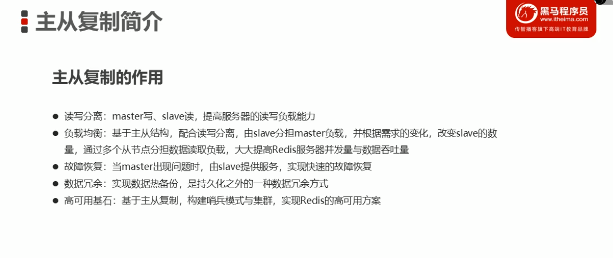
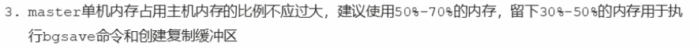
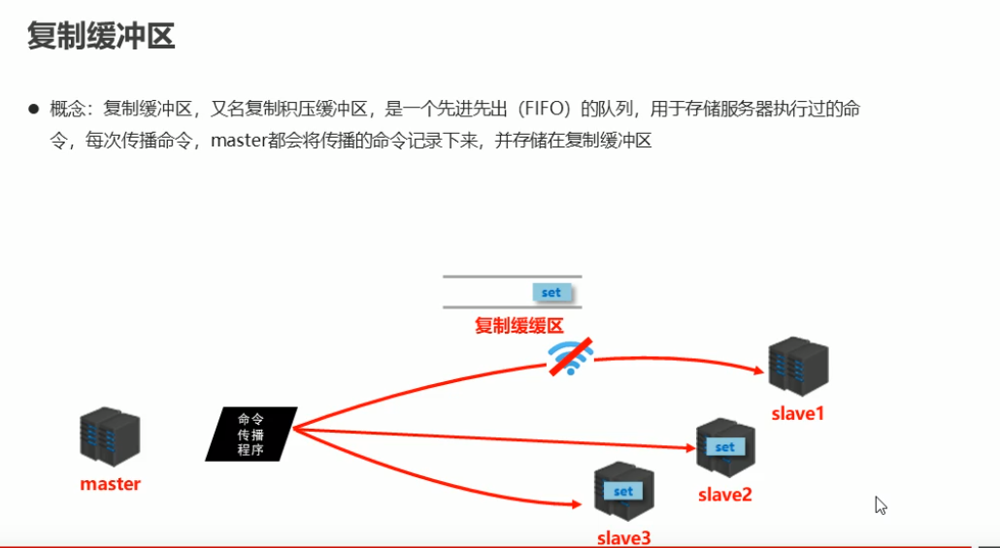
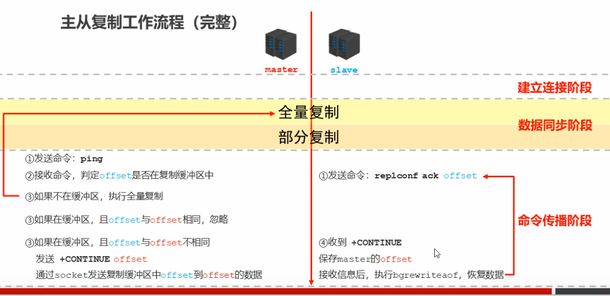
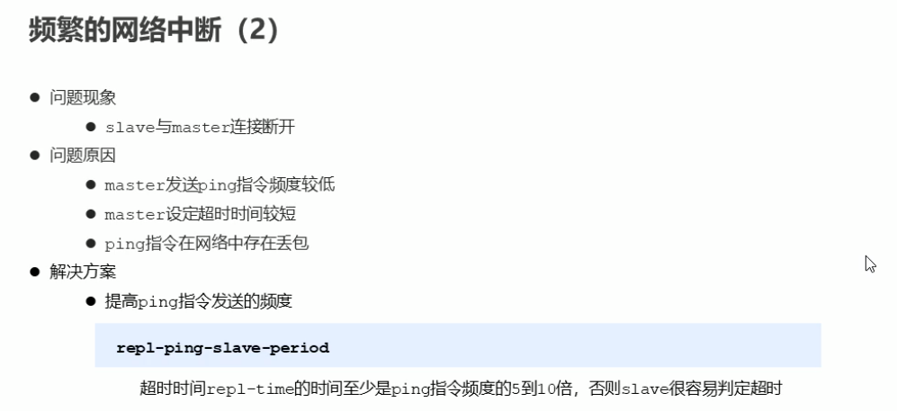
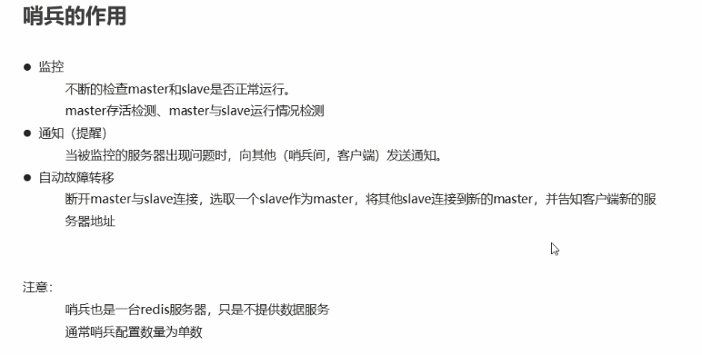

## 常用命令

1. 查看某类命令帮助 `help @sorted_set` `help @set` `help @list` `help @string` `help @hash`
2. 查看key底层存储类型 `object encoding key`

## 核心数据结构


### String


### Hash


Redis有个非常忌讳的东西 bigkey 像上面的将用户表信息都放在了user这个key里，value将包含大量的数据

像大型互联网公司 不可能将所有用户都放入到Redis 通常都是将热点数据（用户） 通过统计日活用户 发现特别活跃每天都来登录放到Redis中


### list


### set


  

 

### zset(sorted_set)


## 数据删除策略

### 定时删除

当key设定的时间到达时，立马删除

### 惰性删除

当key设定的时间达到时，并没有立马删除 而是在get的是否 通过`expireIfNeeded()`函数来进行检测，如果发现过期，删除该数据，否则返回给用户

### 定期删除


## 逐出算法

当新数据进入redis时，如果内存不足怎么办？

Redis使用内存存储数据，在执行每一个命令前，会调用freeMemoryIfNeeded()检测内存是 否充足。如果内存不满足新加入数据的最低存储要求，redis要临时删除一些数据为当前指令清理存储空间。清理数据的策略称为逐出算法（数据淘汰）。

注意：逐出数据的过程不是100%能够清理出足够的可使用的内存空间，如果不成功则反复执行。当对所有数据尝试完毕后，如果不能达到内存清理的要求，将出现错误信息。


相关的配置如上：


操作顺序以秒为单位：

1          2     3      4     5     6         7       8            9

name age age age age addr addr gender name

早期的策略：volatile-lru   redis4.0 中使用no-enviction    建议使用volatile-lru

## Redis主从复制




注意：在redis 2.6.14中 若maste中配置了requirepass linzi  那么 slave 必须要在配置文件中设置masterauth linzi 否则将报如下错误

```shell
[2883] 09 Dec 14:56:23.782 * MASTER <-> SLAVE sync started
[2883] 09 Dec 14:56:23.782 * Non blocking connect for SYNC fired the event.
[2883] 09 Dec 14:56:23.782 * Master replied to PING, replication can continue...
[2883] 09 Dec 14:56:23.782 * (non critical): Master does not understand REPLCONF listening-port: Error from master: -ERR operation not permitted
[2883] 09 Dec 14:56:23.782 # MASTER aborted replication with an error: ERR operation not permitted
```

### 主从复制工作流程 数据同步阶段


部分复制 又叫增量复制

master上显示的日志：


slave上显示的日志：


注意：





### 阶段三：命令传播阶段


### 服务器运行ID


服务器每次重启都将生产新的runid

### 复制积压缓冲区




### 数据同步+命令传播阶段工作流程


### 心跳机制





## 全量复制优化





## 哨兵

### 搭建




### 原理


## 优化

1. mset 比多次 set的优势 `减少网络带宽（因为TCP/IP层需要携带有用的信息） 减少网络IO次数`