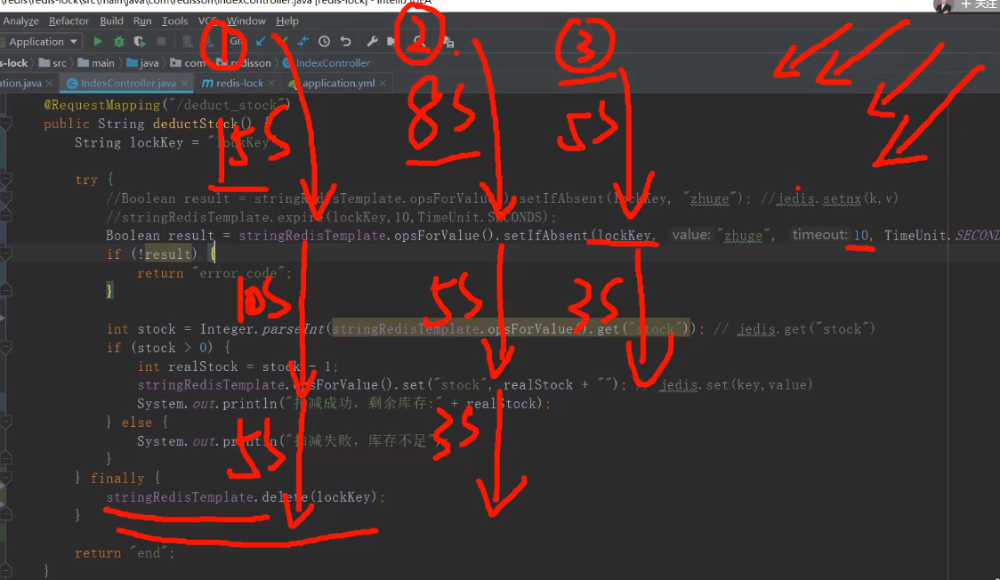
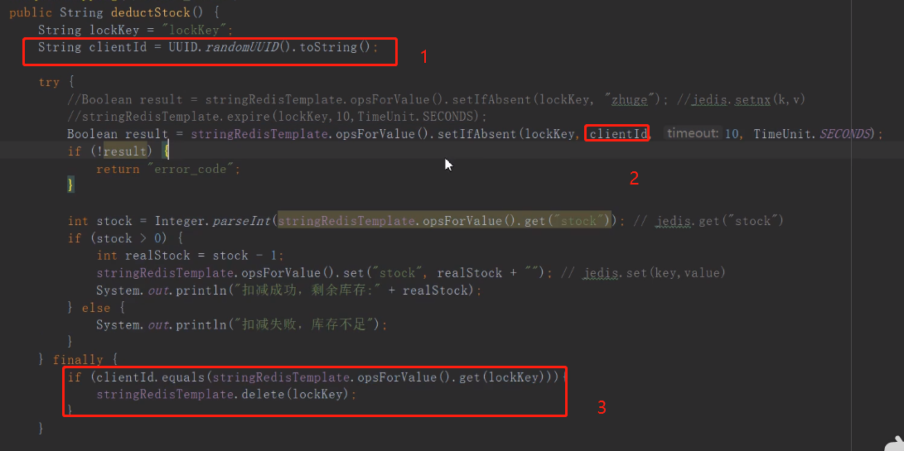
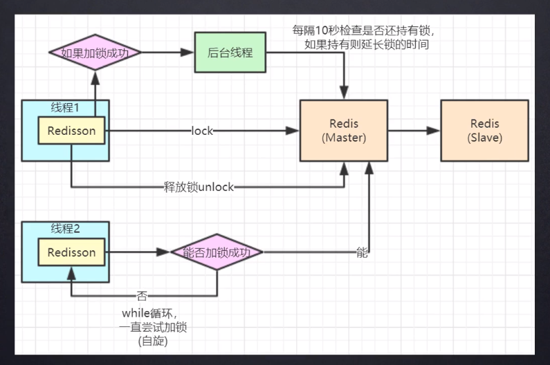
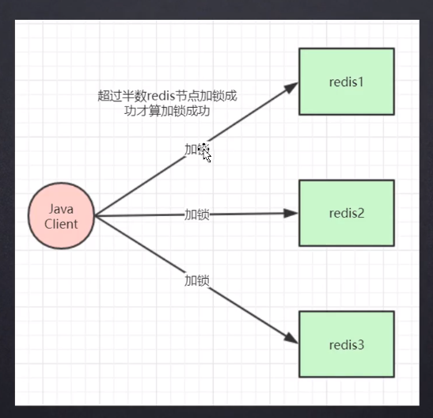
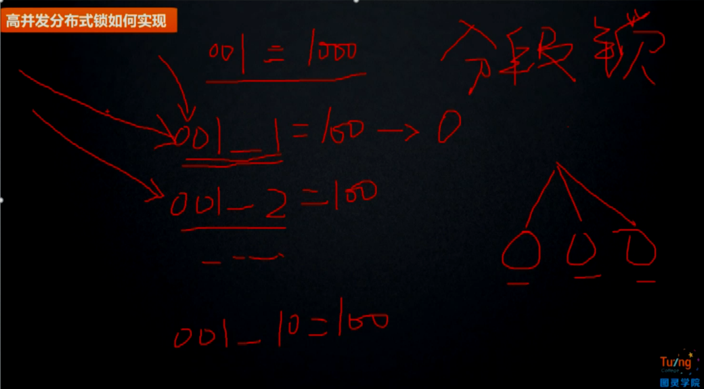

## Redis实现

```java
public String deductStock(){
    String lockKey = "lockKey";
    Boolean result = stringRedisTemplate.opsForValue().setIfAbsent("lockKey","jj");
    if(!result){
        return "error_code"
    }
    // 执行业务
    stringRedisTemplate.delete(lockKey);
}
```

利用redis的setnx简单的实现了分布式锁

存在的问题：

1. 业务执行的过程中抛异常 导致锁没有释放 `可以通过try finally`来解决 但是如果程序直接宕机锁还是没有释放

2. 解决程序直接宕机的 `给锁加过期时间` `SET key value [EX seconds|PX milliseconds|KEEPTTL] [NX|XX] [GET]`

    但是2同样还是存在着问题

    

比如server1 执行这个过程需要15秒 但是在第10秒的时候 锁被释放了 

server2这个时候就可以获得锁 但是在执行到第8秒的时候 server1执行完毕 释放锁 但是这个时候释放的是server2获得的锁

因此 通过expire的方式 在高并发场景下会存在问题

`这个问题主要是因为server1释放了server2的锁` 

可以通过set lockKey server1   或 set lockKey server2 在释放的时候通过判断锁的是否自己设置的



但是这个的做法还是存在着如下的问题：

1. 超时时间 还是不可控 如果设置时间过长 那么 其他server业务无法进行
2. 3处有原子性问题

问题1解决方案：

*锁续命*

server1获得锁之后 同时开启一个线程进行定时检查锁是否存在如果存在重新设置锁的超时时间 防止因为业务执行时间太长 导致锁因为超时被释放

### Redisson 

这个开源的组件已经实现了非常成熟的分布式锁方案

底层实现：



在主从架构下还是可能会存在问题：

比如server1在master中获得lock 然后这个lock还未同步到slave 这个时候master宕机

然后slave在哨兵机制下变成master 这个时候 server2可以在redis中获得lock

要想解决这种问题 

1. redlock 不建议使用

2. zookeeper

    

### 优化



使用分布式锁 性能不高 可以考虑将商品拆分成多份  分段锁

## Zookeeper实现

## MySQL实现

