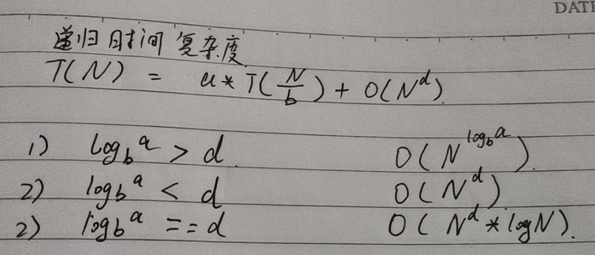

## 第一课

  	>>> 不带符号位右移动 用0填充最高位

 1. 时间复杂度 空间复杂度（额外空间复杂度） 常数项时间（实现细节决定）

 2. 选择排序 冒泡排序 插入排序

 3. 排名从好到差 O（1） O（logN） O(N) O(NlogN) O(N^2) O(2^N) O(N!)  logN 底数是2

 4. 对数器 其实就是自己使用工具产生大量随机数，然后用来检测程序是否对。当然还需要一个完全正确的方法用来对比自己实现的结果是否正确

    比如排序我们可以使用 Array.sort(arr) 得到正确的结果，然后将我们计算的结果与Array.sort的结果进行比较

5. 二分查找 时间复杂度是O（logN）

    比如 8个数     查找4的位置  查找2的位置 查找1的位置  2^3 = 8  因此时间复杂度是logN

    ```java
    public class BSExists{
        public static boolean exists(int sortedArr, int num){
            if(sortedArr == null || sortedArr.length == 0){
                return false;
            }
            
            int L = 0;
            int R = sortedArr.length - 1;
            int mid = 0;
            
            while(L<R){
                mid = L+((R-L)>> 1); // mid = L+(R-L)/2
                if(sortedArr[mid] == num){
                    return true;
                }else if(sortedArr[mid] > num){
                    R = mid - 1;
                }else{
                    L = mid + 1;
                }
            }
            return sortedArr[L] == num;
        }
    }
    ```

    1. 在一个有序数组中，找某个数是否存在

    2. 在一个有序数组中，找到>=某个数，最左侧的位置

    3. 在一个有序数组中，找到<=某个数，最右侧的位置

    4. 在一个无序数组中，找到局部最小值的数 

        1. arr[0]<arr[1]   0是最小值

        2. arr[N-1]>arr[N] N是最小值

        3. 如果以上都不存在的话 那么数组中 一定存在 最小值 因为1中 是下降  2中是上升的趋势

            因此中间总会有一个波底 这个波底就存在局部最小值

6. 异或运算 相同为0 不同为1 满足交换律和结合律
    1. 0^N == N  N^N ==0
    
    2. 交换2个数
        1. a = a^b
        2. b = a^b
    3. a = a^b
    
    3. 一个数组中有一种数出现奇数次，其他数都出现偶数次
    
    4. 一个数组中有2中出现奇数次的数，其他数都出现偶数次
    
    5. 提取一个数最右侧的1    rightOne = N &((~N)+1)
    
    6. 数的最右侧1 除了用来完成4. 还可以统计一个数中1的位数
    
        ```java
        public static int bitCounts(int N){
            int count = 0;
            while(N != 0){
                count++;
                int rightOne = N & (~N + 1);
                N ^= rightOne;
            }
        }
        ```
    
        

## 第二讲

1. 链表

    1. 单向和双向链表反转

    2. 删除链表指定元素

        ```java
        public static Node removeValue(Node head, int num){
            while(head != null){
                if(head.value != num)
                    break;
                head = head.next;
            }
            // head 来到第一个不需要删的位置
            Node pre = head;
            Node cur = head;
            while(cur != null){
                if(cur.value == num){
                    pre.next = cur.next;
                }else{
                    pre = cur;
                }
                cur = cur.next;
            }
            return head;
        }
        
        public static Node reverseLinkedList(Node head){
            Node pre = null;
            Node next = null;
            while(head != null){
                next = head.next;
                head.next = pre;
                pre = head;
                head = next;
            }
            return pre;
        }
        
        public static DoubleNode reverseDoubleList(DoubleNode head){
            DoubleNode pre = null;
            DoubleNode next = null;
            while(head != null){
                next = head.next;
                head.next = pre;
                head.last = next;
                pre = head;
                head = next;
            }
            return pre;
        }
        
        ```

2. 栈（先进后出） 和 队列（先进先出）

    1. 双向链表实现

    2. 数组实现（实现队列的时候 就是 RingBuffer）

        ```java
        public class Code04_RingArray{
            public static class MyQueue{
                private int[] arr;
                private int pushi;
                private int polli;
                private int size;
                private final int limit;
                
                public MyQueue(int l){
                    arr = new int[l];
                    pushi = 0;
                    polli = 0;
                    size = 0;
                    limit = l;
                }
                public void push(int value){
                    if(size == limit){
                        throw new RuntimeException("栈满了，不能再加了");
                    }
                    size++;
                    arr[pushi] = value;
                    pushi = newIndex(pushi);
                }
                
                public int pop(){
                    if(size == 0){
                        throw new RuntimeException("栈空了，不能再拿了");
                    }
                    size--;
                    int ret = arr[polli];
                    polli = nextIndex(polli);
                    return ans;
                }
                
                private int nextIndex(int i){
                    return i < limit -1 ? i+1:0;
                }
                
            }
        }
        ```

        怎么用数组实现不超过固定大小的队列和栈？

        栈：正常使用

        队列：环形数组

    3. 实现一个特殊的栈，在基本功能的基础上，再实现返回栈中最小元素的功能
    
        1. pop push getMin操作的时间复杂度都是O(1)
        2. 设计的栈类型可以使用现成的栈结构
        3. **使用2个栈来解决Data栈 和Min栈**
    
    4. 如何用栈结构实现队列结构 如何用队列结构实现栈结构
    
        1. 两个栈实现队列 （从push栈pop数据到pop栈的时候必须在pop栈为empty的时候，且从push栈中需要将所有数据都pop出来 ）
        
   5. 递归行为 
       
   
    6. 哈希表
   
    7. 有序表
   
       1. AVL SB 红黑树 跳表

## 第三天

1. 归并排序
    1. 整天是递归，左边排好序+右边排好序+merge让整体有序
    2. 让整体有序的过程里用了排外序方法
    3. 利用master公式来求解时间复杂度
    4. 当然可以用非递归实现 
2. 随机快排

```java
// 归并排序 递归实现
public static void mergeSort1(int[] arr){
    if(arr == null || arr.length < 2){
        return;
    }
    process(arr,0,arr.length -1);
}

public static void process(int[] arr, int L, int R){
    if(L == R)
        return;
    
    int mid = L + (R-L)>>1;
    process(arr,L,mid);
    process(arr,mid+1,R);
    merge(arr, L, mid, R);
}

public static void merge(int[] arr,int L, int M, int R){
    int[] help = new int[R-L+1];
    int i=0;
    int p1 = L;
    int p2 = M+1;
    
    while(p1 <= M && p2 <=R){
        help[i++] = arr[p1] <= arr[p2] ? arr[p1++] : arr[p2++];
    }
    while(p1 <= M){
        help[i++] = arr[p1++];
    }
    while(p2<=R){
        help[i++] = arr[p2++];
    }
    for(i = 0; i< help.length;i++){
        arr[L+i] = help[i];
    }
}

// 归并算法 非递归实现
public static void mergeSort2(int[] arr){
    if(arr == null || arr.length < 2)
        return;
    
    int N = arr.length;
    int mergeSize = 1;
    while(mergeSize < N){
        int L = 0;
        while(L < N){
            int M = L + mergeSize -1;
            if(M >= N){	// 也就是到达了arr的结尾了 没有R部分了 
                break;
            }
            int R = Math.min(M+mergeSize, N-1);
            merge(arr,L,M,R);
            L = R + 1;
        }
        if(mergeSize > N / 2)	// 防止 mergeSize <<= 1 溢出
            break;
        mergeSize <<=1;
    }
}

```

