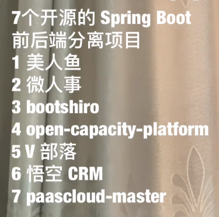

## 分布式唯一id

基于redis的分布式ID生成器。

[redis-id-generator](https://github.com/hengyunabc/redis-id-generator)

提供号码段模式

ID Generator id生成器 分布式id生成系统，简单易用、高性能、高可用的id生成系统

[didi/*tinyid*](https://github.com/didi/tinyid)

Twitter的雪花算法*SnowFlake*，使用Java语言实现。

[beyondfengyu/*SnowFlake*](https://github.com/beyondfengyu/SnowFlake)

UniqueID *generator* 提供的雪花算法模式

[baidu/*uid*-*generator*](https://github.com/baidu/uid-generator)

Distributed ID Generate Service 美团的 提供2种模式 号段模式和雪花算法模式

[Leaf](https://github.com/Meituan-Dianping/Leaf)

[Leaf——美团点评分布式ID生成系统](https://tech.meituan.com/2017/04/21/mt-leaf.html)

## 开源项目

`mall`项目是一套电商系统，包括前台商城系统及后台管理系统，基于SpringBoot+MyBatis实现，采用Docker容器化部署。前台商城系统包含首页门户、商品推荐、商品搜索、商品展示、购物车、订单流程、会员中心、客户服务、帮助中心等模块。后台管理系统包含商品管理、订单管理、会员管理、促销管理、运营管理、内容管理、统计报表、财务管理、权限管理、设置等模块。

[macrozheng](https://github.com/macrozheng)/**[mall](https://github.com/macrozheng/mall)**

**Halo** `[ˈheɪloʊ]`，意为光环。当然，你也可以当成拼音读(哈喽)。

一个优秀的开源博客发布应用，值得一试。

[halo-dev](https://github.com/halo-dev)/**[halo](https://github.com/halo-dev/halo)**

Hutool是一个小而全的Java工具类库，通过静态方法封装，降低相关API的学习成本，提高工作效率，使Java拥有函数式语言般的优雅，让Java语言也可以“甜甜的”。
[looly](https://github.com/looly)/**[hutool](https://github.com/looly/hutool)**

[limingfan2016/game_service_system](https://github.com/limingfan2016/game_service_system)