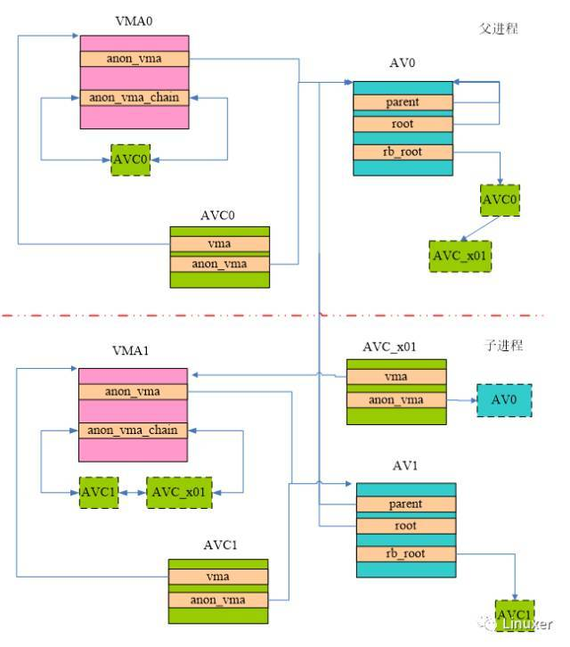
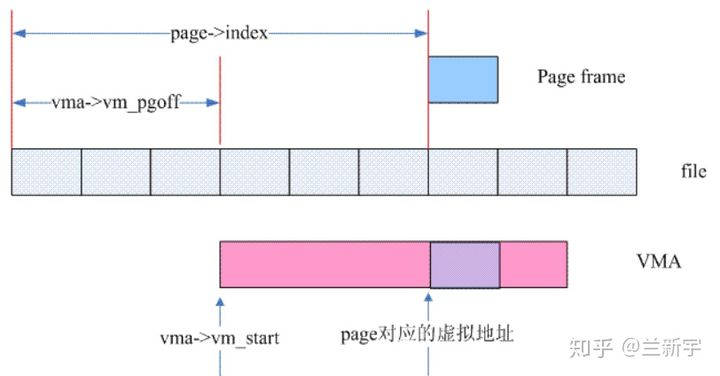
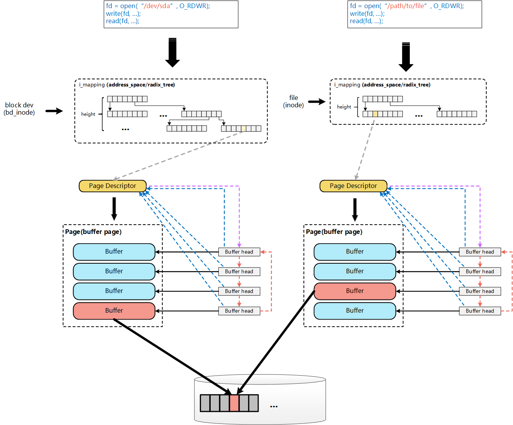

## 内存系统

[Linux内存管理之page fault处理](https://www.cnblogs.com/LoyenWang/p/12116570.html)

[郭健： Linux内存逆向映射（reverse mapping）技术的前世今生](https://www.sohu.com/a/294105390_467784)

[Linux中的Page Cache](https://zhuanlan.zhihu.com/p/68071761)

## 文件系统

[Linux内核Page Cache和Buffer Cache关系及演化历史](https://blog.csdn.net/jinking01/article/details/107480248)

