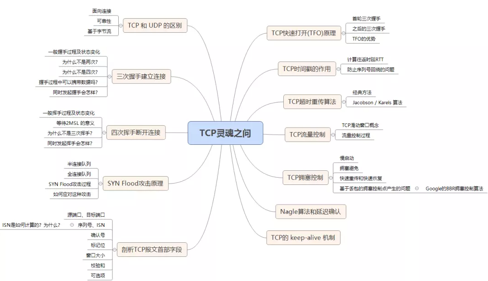
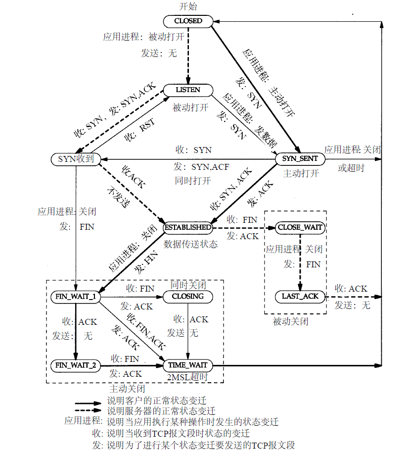
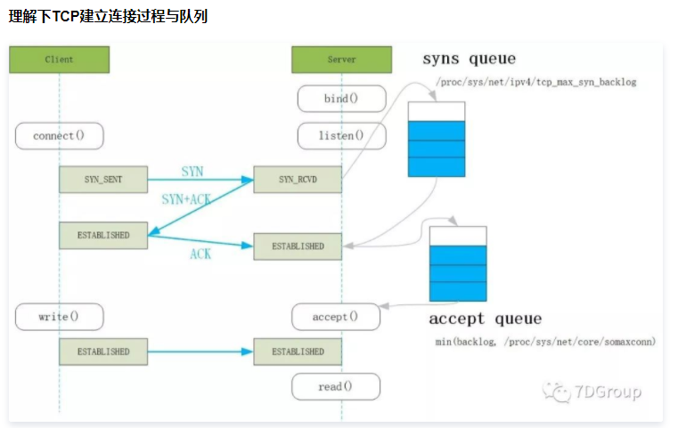

# 知识体系




# 协议

## 三次握手与四次挥手流程图







​	图片链接：[性能分析之TCP全连接队列占满问题分析及优化过程](https://cloud.tencent.com/developer/article/1558493)

## TCP 为什么三次握手而不是两次握手

[TCP 为什么是三次握手，而不是两次或四次？](https://www.zhihu.com/question/24853633)

- 为了实现可靠数据传输， TCP 协议的通信双方， 都必须维护一个序列号， 以标识发送出去的数据包中， 哪些是已经被对方收到的。 三次握手的过程即是**通信双方相互告知序列号起始值**， 并确认对方已经收到了序列号起始值的必经步骤
- 如果只是两次握手， 至多只有连接发起方的起始序列号能被确认， 另一方选择的序列号则得不到确认
- 保证双方都得知对方的接收、发送能力正常。其中第三次握手是为了让服务端得知客户端的接收能力正常、服务端的发送能力正常
- TCP 需要 seq 序列号来做可靠重传或接收，而避免连接复用时无法分辨出 seq 是延迟或者是旧链接的 seq，因此需要三次握手来约定确定双方的 ISN（初始 seq 序列号）

补充：

**第一个包 即A发给B的SYN中途丢失，没有到达B**

A会周期性超时重传，直到收到B的确认

**第二个包，即B发给A的SYN+ACK中途丢失，没有到达A**

B会周期性超时重传，直到收到A的确认

**第三个包，即A发给B的ACK中途丢失，没有达到B**

A发完ACK 单方面认为TCP为Established状态，而B显然认为TCP为Active状态

a. 假定此时双方都没有数据发送，B会周期性超时重传，直到收到A的确认，收到之后B的TCP连接也为Established状态，双向可以发包

b.假定此时A有数据发送，B收到A的Data+ACK 自然会切换为Established状态，并接受A的Data

c.假定B有数据发送，数据发送不了，会一直周期性超时重传SYN+ACK，直到收到A的确认才可以发送数据

## 为什么建立连接是三次握手，而关闭连接却是四次挥手

答：因为当Server端收到Client端的SYN连接请求报文后，可以直接发送SYN+ACK报文。其中ACK报文是用来应答的，SYN报文是用来同步的。但是关闭连接时，当Server端收到FIN报文时，很可能并不会立即关闭SOCKET，所以只能先回复一个ACK报文，告诉Client端，"你发的FIN报文我收到了"。只有等到我Server端所有的报文都发送完了，我才能发送FIN报文，因此不能一起发送。故需要四步握手。

## 为什么TIME_WAIT状态需要经过2MSL(最大报文段生存时间)才能返回到CLOSE状态

虽然按道理，四个报文都发送完毕，我们可以直接进入CLOSE状态了，但是我们必须假象网络是不可靠的，有可以最后一个ACK丢失。所以TIME_WAIT状态就是用来重发可能丢失的ACK报文。在Client发送出最后的ACK回复，但该ACK可能丢失。Server如果没有收到ACK，将不断重复发送FIN片段。所以Client不能立即关闭，它必须确认Server接收到了该ACK。Client会在发送出ACK之后进入到TIME_WAIT状态。Client会设置一个计时器，等待2MSL的时间。如果在该时间内再次收到FIN，那么Client会重发ACK并再次等待2MSL。所谓的2MSL是两倍的MSL(Maximum Segment Lifetime)。MSL指一个片段在网络中最大的存活时间，2MSL就是一个发送和一个回复所需的最大时间。如果直到2MSL，Client都没有再次收到FIN，那么Client推断ACK已经被成功接收，则结束TCP连接。

## 为何Reset报文不需要ACK确认

因为发送Reset报文的一端，在发送完这个报文之后，和该TCP Session有关的内存结构体瞬间全部释放，无论对方收到或没有收到，关系并不大。

如果对方收到Reset报文，也会释放该TCP Session 的相关内存结构体。

如果对方没有收到Reset 报文，可能会继续发送让接收方弹射出Reset报文的报文，到最后对方一样会收到Reset 报文，并最终释放内存。

## 四次挥手释放连接时，等待2MSL的意义

> **MSL**是Maximum Segment Lifetime的英文缩写，可译为“最长报文段寿命”，它是任何报文在网络上存在的最长时间，超过这个时间报文将被丢弃。

为了保证客户端发送的最后一个ACK报文段能够到达服务器。因为这个ACK有可能丢失，从而导致处在LAST-ACK状态的服务器收不到对FIN-ACK的确认报文。服务器会超时重传这个FIN-ACK，接着客户端再重传一次确认，重新启动时间`等待计时器`。最后客户端和服务器都能正常的关闭。假设客户端不等待2MSL，而是在发送完ACK之后直接释放关闭，一但这个ACK丢失的话，服务器就无法正常的进入关闭连接状态。

#### 两个理由：

1. **保证客户端发送的最后一个ACK报文段能够到达服务端**。

    这个ACK报文段有可能丢失，使得处于LAST-ACK状态的B收不到对已发送的FIN+ACK报文段的确认，服务端超时重传FIN+ACK报文段，而客户端能在2MSL时间内收到这个重传的FIN+ACK报文段，接着客户端重传一次确认，重新启动2MSL计时器，最后客户端和服务端都进入到CLOSED状态，若客户端在TIME-WAIT状态不等待一段时间，而是发送完ACK报文段后立即释放连接，则无法收到服务端重传的FIN+ACK报文段，所以不会再发送一次确认报文段，则服务端无法正常进入到CLOSED状态。

2. **防止“已失效的连接请求报文段”出现在本连接中**。

    客户端在发送完最后一个ACK报文段后，再经过2MSL，就可以使本连接持续的时间内所产生的所有报文段都从网络中消失，使下一个新的连接中不会出现这种旧的连接请求报文段。

## SYN攻击

**服务器端的资源分配是在二次握手时分配的，而客户端的资源是在完成三次握手时分配的**，所以服务器容易受到SYN洪泛攻击。SYN攻击就是Client在短时间内伪造大量不存在的IP地址，并向Server不断地发送SYN包，Server则回复确认包，并等待Client确认，由于源地址不存在，因此Server需要不断重发直至超时，这些伪造的SYN包将长时间占用未连接队列，导致正常的SYN请求因为队列满而被丢弃，从而引起网络拥塞甚至系统瘫痪。SYN 攻击是一种典型的 DoS/DDoS 攻击。

检测 SYN 攻击非常的方便，当你在服务器上看到大量的半连接状态时，特别是源IP地址是随机的，基本上可以断定这是一次SYN攻击。在 Linux/Unix 上可以使用系统自带的 netstat 命令来检测 SYN 攻击。

```
netstat -n -p TCP | grep SYN_RECV
```

常见的防御 SYN 攻击的方法有如下几种：

1. 增加 SYN 连接，也就是增加半连接队列的容量。
2. 减少 SYN + ACK 重试次数，避免大量的超时重发。
3. 利用 SYN Cookie 技术，在服务端接收到 `SYN`后不立即分配连接资源，而是根据这个 `SYN`计算出一个Cookie，连同第二次握手回复给客户端，在客户端回复 `ACK`的时候带上这个 `Cookie`值，服务端验证 Cookie 合法之后才分配连接资源

# 系统API

# Linux内核参数

环境CentOS7 x86_64 

## tcp_syn_retries ：INTEGER

默认值是6
对于一个新建连接，内核要发送多少个 SYN 连接请求才决定放弃。不应该大于255，默认值是5，对应于180秒左右时间。(对于大负载而物理通信良好的网络而言,这个值偏高,可修改为2.这个值仅仅是针对对外的连接,对进来的连接,是由***\*tcp_retries1\****决定的)

### tcp_synack_retries ：INTEGER
默认值是5
对于远端的连接请求SYN，内核会发送SYN ＋ ACK数据报，以确认收到上一个 SYN连接请求包。这是所谓的三次握手( threeway handshake)机制的第二个步骤。这里决定内核在放弃连接之前所送出的 SYN+ACK 数目。不应该大于255，默认值是5，对应于180秒左右时间。(可以根据上面的 **tcp_syn_retries** 来决定这个值)


/proc/sys/net/core/somaxconn 

/proc/sys/net/ipv4/tcp_syn_backlog

参考：https://www.cnblogs.com/shihuvini/p/9648377.html


`tcp_abort_on_overflow` 为0表示如果`三次握手第三步的时候全连接队列满了`那么server`扔掉client 发过来的ack`（在server端认为`连接还没建立起来`）;1表示第三步的时候如果全连接队列满了，server`发送一个reset包给client`，表示废掉这个握手过程和这个连接（本来在server端这个连接就还没建立起来）。

隔一段时间server重发握手第二步的syn+ack包给client,重发多少次由`/proc/sys/net/ipv4/tcp_synack_retries`决定），如果这个连接一直排不上队就异常了

```shell
[root@localhost core]# pwd
/proc/sys/net/core
[root@localhost core]# ls
bpf_jit_enable    						#
bpf_jit_harden                          #
bpf_jit_kallsyms                        #
busy_poll                               #
busy_read                               #
default_qdisc                           #
dev_weight                              #
dev_weight_rx_bias                      #
dev_weight_tx_bias                      #
message_burst                           #
message_cost                            #
netdev_budget                           #
netdev_max_backlog                      #
netdev_rss_key                          #
netdev_tstamp_prequeue                  #
optmem_max                              #
rmem_default                            #
rmem_max                                #
rps_sock_flow_entries                   #
somaxconn                               # 半链接和全链接队列参数之一 max(backlog,somaxconn)
warnings                                #
wmem_default                            #
wmem_max                                #
xfrm_acq_expires                        #
xfrm_aevent_etime                       #
xfrm_aevent_rseqth                      #
xfrm_larval_drop                        #
```


```shell
[root@localhost ipv4]# pwd
/proc/sys/net/ipv4
[root@localhost ipv4]# ls
cipso_cache_bucket_size           		#
cipso_cache_enable                      #
cipso_rbm_optfmt                        #
cipso_rbm_strictvalid                   #
conf                                    #
fib_multipath_hash_policy               #
fwmark_reflect                          #
icmp_echo_ignore_all                    #
icmp_echo_ignore_broadcasts             #
icmp_errors_use_inbound_ifaddr          #
icmp_ignore_bogus_error_responses       #
icmp_msgs_burst                         #
icmp_msgs_per_sec                       #
icmp_ratelimit                          #
icmp_ratemask                           #
igmp_max_memberships                    #
igmp_max_msf                            #
igmp_qrv                                #
inet_peer_maxttl                        #
inet_peer_minttl                        #
inet_peer_threshold                     #
ip_default_ttl                          #
ip_dynaddr                              #
ip_early_demux                          #
ip_forward                              #
ip_forward_use_pmtu                     #
ipfrag_high_thresh                      #
ipfrag_low_thresh                       #
ipfrag_max_dist                         #
ipfrag_secret_interval                  #
ipfrag_time                             #
ip_local_port_range                     #
ip_local_reserved_ports                 #
ip_nonlocal_bind                        #
ip_no_pmtu_disc                         #
neigh                                   #
ping_group_range                        #
route                                   #
tcp_abort_on_overflow                   #
tcp_adv_win_scale                       #
tcp_allowed_congestion_control          #
tcp_app_win                             #
tcp_autocorking                         #
tcp_available_congestion_control        #
tcp_base_mss                            #
tcp_challenge_ack_limit                 #
tcp_congestion_control                  #
tcp_dsack                               #
tcp_early_retrans                       #
tcp_ecn                                 #
tcp_fack                                #
tcp_fastopen                            #
tcp_fastopen_key                        #
tcp_fin_timeout                         #
tcp_frto                                #
tcp_invalid_ratelimit                   #
tcp_keepalive_intvl                     #
tcp_keepalive_probes                    #
tcp_keepalive_time                      #
tcp_limit_output_bytes                  #
tcp_low_latency                         #
tcp_max_orphans                         #
tcp_max_ssthresh                        #
tcp_max_syn_backlog                     #
tcp_max_tw_buckets                      #
tcp_mem                                 #
tcp_min_snd_mss                         #
tcp_min_tso_segs                        #
tcp_moderate_rcvbuf                     #
tcp_mtu_probing                         #
tcp_no_metrics_save                     #
tcp_notsent_lowat                       #
tcp_orphan_retries                      #
tcp_reordering                          #
tcp_retrans_collapse                    #
tcp_retries1                            #
tcp_retries2                            #
tcp_rfc1337                             #
tcp_rmem                                #
tcp_sack                                #
tcp_slow_start_after_idle               #
tcp_stdurg                              #
tcp_synack_retries                      #
tcp_syncookies                          #
tcp_syn_retries                         #
tcp_thin_dupack                         #
tcp_thin_linear_timeouts                #
tcp_timestamps                          #
tcp_tso_win_divisor                     #
tcp_tw_recycle                          #
tcp_tw_reuse                            #
tcp_window_scaling                      #
tcp_wmem                                #
tcp_workaround_signed_windows           #
udp_mem                                 #
udp_rmem_min                            #
udp_wmem_min                            #
xfrm4_gc_thresh                         #
```

# 命令

```shell
[root@ngx32 ~]# netstat -na |awk '{print $6}'| sort |uniq -c |sort -nr
    490 ESTABLISHED
     44 SYN_RECV
     34 LAST_ACK
     10 CONNECTED
      5 LISTEN
      3 CLOSE_WAIT
      2 
      1 established)
      1 and
      1 I-Node
      1 Foreign
      1 7894382
      1 6343
      1 6250
      1 6241
      1 3937508
      1 2837682
      1 1863
```


# 网络查找故障

[性能分析之TCP全连接队列占满问题分析及优化过程](https://cloud.tencent.com/developer/article/1558493)


# 面试资料

[[TCP协议面试10连问，总会用得到，建议收藏~](https://my.oschina.net/u/4581745/blog/4889494)

[调整Linux的网络栈（Buffer Size）来提升网络性能](https://segmentfault.com/a/1190000000473365)

[深入浅出TCP中的SYN-Cookies](https://segmentfault.com/a/1190000019292140)

[CentOS7开启BBR拥塞控制算法](https://segmentfault.com/a/1190000010245160)